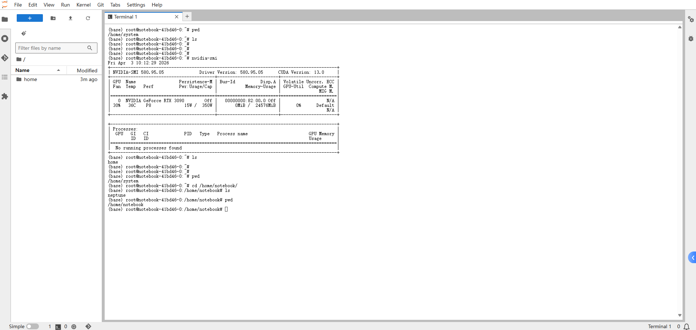
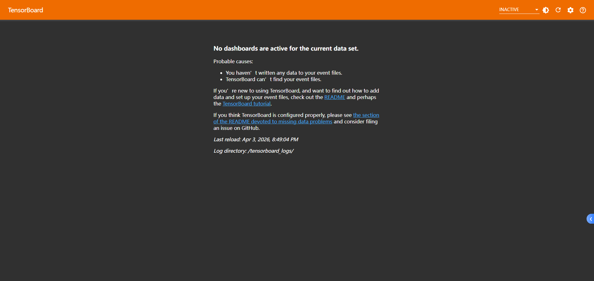
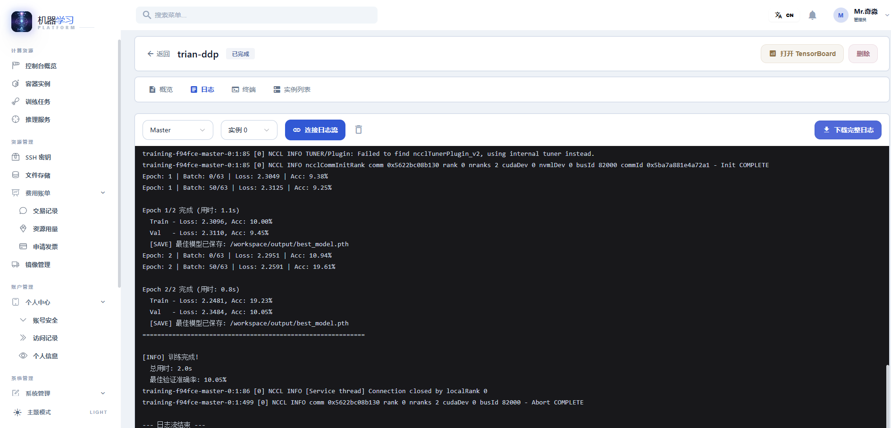
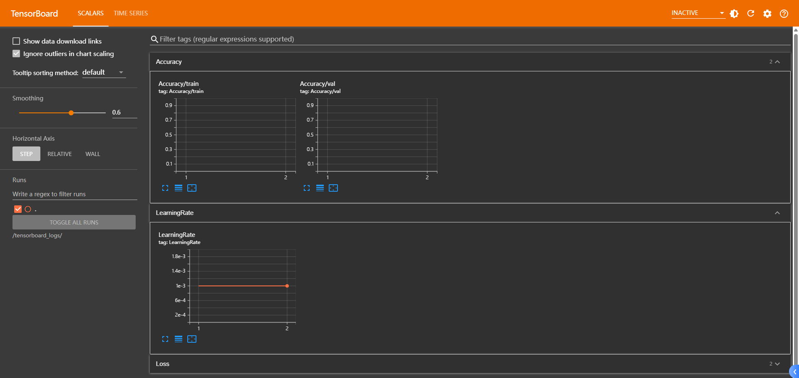
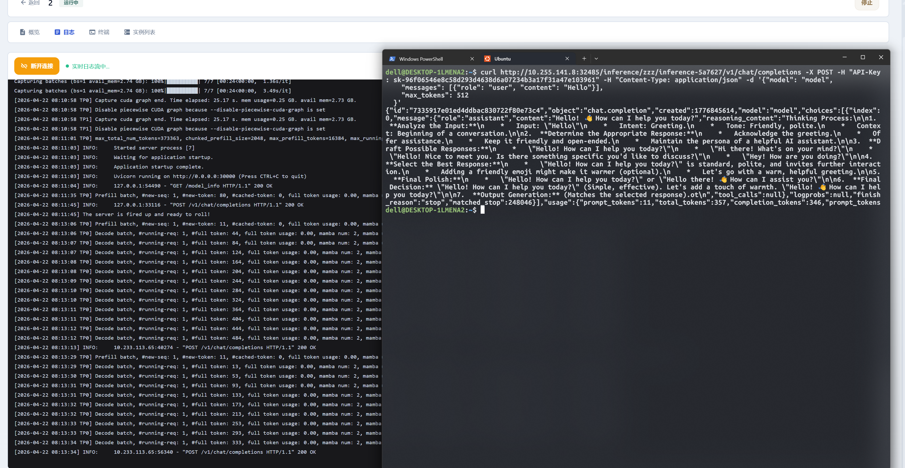
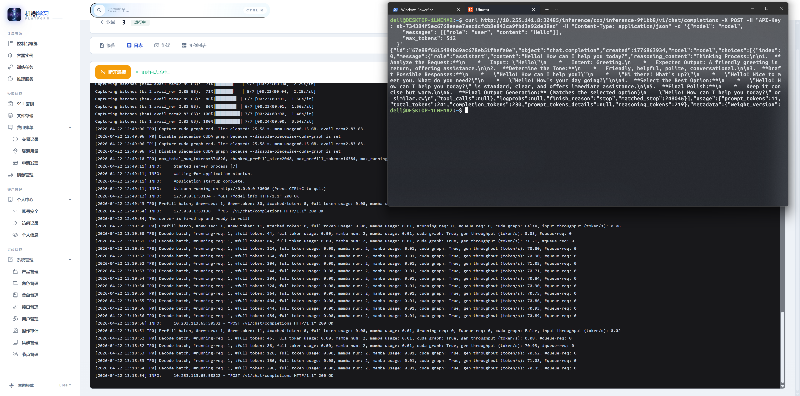
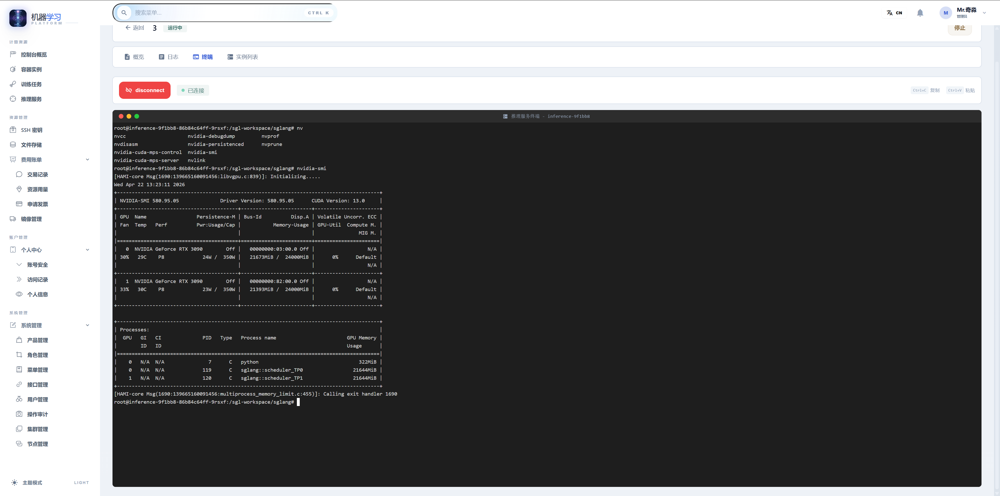

<p align="center">
  
</p>

<h1 align="center">Neptune · 机器学习平台</h1>

<p align="center">
  基于 Kubernetes 的一站式 AI 基础设施管理平台，提供 GPU 容器实例、分布式训练、模型推理和全生命周期资源管理。
</p>

<p align="center">
  
  
  
  
  
</p>

---

## 📖 目录

- [功能概述](#-功能概述)
- [技术架构](#-技术架构)
- [项目结构](#-项目结构)
- [环境要求](#-环境要求)
- [快速启动](#-快速启动)
- [界面预览](#-界面预览)
- [部署方式](#-部署方式)
- [配置说明](#-配置说明)

---

## ✨ 功能概述

### 🖥️ 容器实例（Notebook）

- 基于 Kubeflow Notebook Controller 的 GPU 交互式计算环境
- 支持 JupyterLab、VS Code Server 等多种 IDE
- 内置 SSH 连接（通过 SSHPiper 动态路由）
- TensorBoard 可视化训练监控
- 实例生命周期管理（创建、启动、停止、删除）

### 🏋️ 分布式训练

- 基于 Volcano 的分布式训练任务调度
- 支持 PyTorch DDP、MPI 等主流框架
- Master/Worker 多节点配置
- 实时日志流和任务状态监控

### 🚀 模型推理

- 在线推理服务部署与管理
- API Key 访问控制和流量策略
- 服务自动扩缩容

### 📦 资源管理

- **文件存储**：基于 Kubernetes PVC 的持久化存储，支持容器/训练/推理间共享
- **SSH 密钥**：密钥对管理，支持密钥登录容器实例
- **镜像管理**：基础镜像、社区镜像和自定义镜像

### 💰 费用与账单

- 按量计费 / 包时计费 多种计费模式
- 实时余额和消费趋势监控
- 交易记录和发票管理

### ⚙️ 系统管理

- 多集群管理（K8s 集群动态注册）
- 基于 Casbin 的 RBAC 权限控制
- 角色管理、菜单管理、API 管理
- 操作审计和访问日志
- 产品和定价管理
- 中英文双语支持

---

## 🏗️ 技术架构

```
+------------------------------------------------------------------+
|                    Browser / SSH Client                          |
+----------------------+-------------------------------+------------+
                       |                               |
                 HTTP / WS (:80)                 SSH (:22)
                       |                               |
                       v                               v
                 +--------------------+         +--------------+
                 |   APISIX Gateway   |         | APISIX Stream|
                 |    (统一入口)      |         |  (K8s 模式)  |
                 +---------+----------+         +------+-------+
                           |                           |
      +--------------------+--------------------+      |
      |                                         |      v
      | /                                       |  +----------+
      v                                         v  | SSHPiper |
+---------------------+                +-----------------------+
|    Neptune Web      |                |    Neptune Server     |
|   (Vue3 + Nginx)    |                |      (Go + Gin)       |
+---------------------+                +----+-------------+-----+
                                            |             |
                                            v             v
                                        +-------+     +---------+
                                        | MySQL |     |  Redis  |
                                        +-------+     +---------+
                                                 \
                                                  v
                                      +---------------------------+
                                      |      Kubernetes API       |
                                      | Kubeflow / Volcano / PVC  |
                                      +---------------------------+
```

- HTTP 统一入口：`APISIX` 按路径转发，`/` 到前端，`/aiInfra/*` 到后端。
- WebSocket（日志流/终端）同样走 APISIX 的 HTTP 网关链路。
- SSH 流量链路（APISIX Stream -> SSHPiper）在 Kubernetes 部署中启用，Compose 主要覆盖 HTTP 网关场景。

### 技术栈

| 层级 | 技术 |
|------|------|
| **前端** | Vue 3 + Vite + Element Plus + UnoCSS + ECharts |
| **后端** | Go 1.24 + Gin + GORM + Casbin + Viper |
| **数据库** | MySQL 8.0 + Redis 7 |
| **容器编排** | Kubernetes + Kubeflow + Volcano |
| **网关** | APISIX（HTTP 反向代理 + TCP Stream） |
| **SSH** | SSHPiper（基于用户名的动态 SSH 路由） |

---

## 📂 项目结构

```
neptune/
├── server/                  # 后端服务 (Go)
│   ├── api/v1/              # API 接口层
│   ├── config/              # 配置结构体
│   ├── core/                # 核心组件初始化 (Zap, Viper, Server)
│   ├── global/              # 全局变量
│   ├── initialize/          # 初始化 (Router, DB, Redis, K8s)
│   ├── middleware/          # Gin 中间件
│   ├── model/               # 数据模型
│   ├── router/              # 路由注册
│   ├── service/             # 业务逻辑
│   ├── mcp/                 # MCP 协议服务
│   ├── Dockerfile           # 后端镜像构建
│   ├── config.yaml          # 生产配置
│   └── config.dev.yaml      # 开发配置
│
├── web/                     # 前端 (Vue 3)
│   ├── src/
│   │   ├── api/             # API 请求封装
│   │   ├── components/      # 公共组件
│   │   ├── i18n/locales/    # 国际化 (zh-CN / en-US)
│   │   ├── pinia/           # 状态管理
│   │   ├── view/            # 页面视图
│   │   └── router/          # 前端路由
│   ├── Dockerfile           # 前端镜像构建
│   └── nginx.deploy.conf    # 部署态前端 Nginx 配置（docker compose/容器直连调试）
│
├── deploy/                  # 部署配置
│   ├── docker-compose/      # Docker Compose 部署（含 APISIX 网关）
│   │   ├── docker-compose.yaml
│   │   ├── config.yaml
│   │   └── apisix/
│   │       ├── config.yaml  # APISIX 运行配置（standalone）
│   │       └── apisix.yaml  # APISIX 路由配置
│   └── kubernetes/          # Kubernetes 部署
│       ├── server/          # 后端 K8s 资源
│       ├── web/             # 前端 K8s 资源
│       └── component/       # 依赖组件一键部署
│           ├── kubeflow/    # Notebook/TB Controller
│           ├── volcano/     # 训练任务调度器
│           ├── apisix/      # API 网关
│           └── sshpiper/    # SSH 路由
│
└── docs/                    # 文档
```

---

## 📋 环境要求

### 开发环境

| 依赖 | 版本 |
|------|------|
| Go | >= 1.24 |
| Node.js | >= 20 |
| MySQL | >= 8.0 |
| Redis | >= 6.0 |

### 生产环境

| 依赖 | 版本 |
|------|------|
| Kubernetes | >= 1.28 |
| Helm | >= 3.x |
| Docker | >= 24.x |

---

## 🚀 快速启动

### 方式一：本地开发

**1. 启动后端**

```bash
cd server

# 复制开发配置（首次）
# 修改 config.dev.yaml 中的 MySQL 和 Redis 连接信息

# 启动服务（默认端口 8001）
go run main.go
```

**2. 启动前端**

```bash
cd web

# 安装依赖
npm install

# 启动开发服务器（默认端口 5173）
npm run dev
```

访问 http://localhost:5173

### 方式二：Docker Compose

```bash
# 在项目根目录执行
docker compose -f deploy/docker-compose/docker-compose.yaml up -d --build
```

服务启动后：
- **统一网关入口（APISIX）**: http://localhost
- **前端页面**: http://localhost
- **前端页面（直连调试）**: http://localhost:8080
- **后端 API（经 APISIX）**: http://localhost/aiInfra
- **后端 API（直连排障）**: http://localhost:8888/aiInfra

---

## 🖼️ 界面预览

### 容器实例（Notebook）



### 训练任务



### 推理服务





## 📦 部署方式

### Docker Compose 部署

适用于**单机部署、测试环境**。

```bash
docker compose -f deploy/docker-compose/docker-compose.yaml up -d --build
```

包含服务：APISIX、Neptune Web、Neptune Server、MySQL、Redis

路由关系：
- `http://localhost/` -> `neptune-web:8080`
- `http://localhost:8080/` -> `neptune-web:8080`（直连调试）
- `http://localhost/aiInfra/*` -> `neptune-server:8888`

> ⚠️ Docker Compose 模式不包含 Kubernetes 相关功能（Notebook、Training 等需要 K8s 集群支持）

### Kubernetes 部署

适用于**生产环境**。

`deploy_all.sh` 只负责部署基础组件，不会自动部署 Neptune 平台自己的前后端服务和平台入口路由。

**1. 部署依赖组件**

```bash
# 一键部署 Volcano、Kubeflow、APISIX、SSHPiper
bash deploy/kubernetes/component/deploy_all.sh
```

**2. 创建 Neptune 命名空间**

```bash
kubectl apply -f deploy/kubernetes/namespace.yaml
```

**3. 部署后端**

```bash
kubectl apply -f deploy/kubernetes/server/
```

**4. 部署前端**

```bash
kubectl apply -f deploy/kubernetes/web/
```

**5. 部署平台 APISIX 入口路由**

```bash
kubectl apply -f deploy/kubernetes/component/apisix/neptune-platform-route.yaml
```

> 📝 部署前请先修改镜像地址、Ingress 域名，以及 `deploy/kubernetes/server/gva-server-configmap.yaml` 中的网关相关配置

---

## ⚙️ 配置说明

| 配置文件 | 用途 |
|----------|------|
| `server/config.dev.yaml` | 本地开发配置 |
| `server/config.yaml` | 生产配置模板 |
| `deploy/docker-compose/config.yaml` | Docker Compose 环境配置 |
| `deploy/docker-compose/apisix/config.yaml` | Compose 下 APISIX 运行配置（standalone） |
| `deploy/docker-compose/apisix/apisix.yaml` | Compose 下 APISIX 路由配置 |
| `deploy/kubernetes/server/gva-server-configmap.yaml` | K8s 环境配置 |
| `deploy/kubernetes/web/neptune-web-nginx-configmap.yaml` | K8s 前端 Nginx 配置 |

> 本地开发默认走 Vite dev server，不使用 Nginx。

### 推荐修改顺序

#### 1. 本地开发

- **后端配置文件**：`server/config.dev.yaml`
- **适用场景**：本地启动 `server`，外部已有 APISIX / Kubernetes 网关，或者你在开发环境联调网关访问

重点关注：

- **`system.addr`**：后端监听端口，默认 `8001`
- **`apisix.base-domain`**：APISIX 对外访问域名或地址，本地一般填 `localhost`
- **`apisix.auth-uri`**：APISIX 能访问到的后端认证地址
- **`apisix.http-port`**：APISIX 对外暴露的 HTTP 端口，例如 `8888`
- **`apisix.ssh-ingress-port`**：APISIX Pod / 进程内部监听的 SSH 入口端口，通常是 `9100`
- **`sshpiper.host`**：用户最终访问 SSH 的地址，本地通常填 `127.0.0.1`
- **`sshpiper.port`**：用户看到的 SSH 端口，统一经网关暴露时通常是 `22`

示例：

```yaml
system:
  addr: 8001
  router-prefix: "aiInfra"

apisix:
  enabled: true
  base-domain: "localhost"
  gateway-namespace: "apisix"
  auth-enabled: true
  auth-uri: "http://localhost:8001/aiInfra/api/v1/apisix/auth"
  http-port: 8888
  ssh-ingress-port: 9100

sshpiper:
  host: "127.0.0.1"
  port: 22
```

#### 2. Docker Compose

- **配置文件**：`deploy/docker-compose/config.yaml`
- **适用场景**：单机部署、功能体验、接口联调

因为 APISIX 和后端都在 Compose 网络里，所以 `auth-uri` 应填写 **容器之间可访问的地址**，不是宿主机地址。

示例：

```yaml
apisix:
  enabled: true
  base-domain: "localhost"
  gateway-namespace: "apisix"
  auth-enabled: true
  auth-uri: "http://neptune-server:8888/aiInfra/api/v1/apisix/auth"
  http-port: 80

sshpiper:
  host: "127.0.0.1"
  port: 22
```

说明：

- **`base-domain`**：用于生成 Notebook / TensorBoard / Inference 的访问地址
- **`auth-uri`**：这里必须写 Compose 网络内的服务名，例如 `neptune-server`
- **`http-port`**：这里填写 APISIX 对外 HTTP 入口端口；Compose 默认是 `80`

#### 3. Kubernetes

- **配置文件**：`deploy/kubernetes/server/gva-server-configmap.yaml`
- **适用场景**：正式环境 / 集群部署

Kubernetes 下最容易填错的是 `base-domain`、`auth-uri`、`http-port`、`sshpiper.host`。

示例：

```yaml
apisix:
  enabled: true
  base-domain: "ai.example.com"
  gateway-namespace: "apisix"
  auth-enabled: true
  auth-uri: "http://neptune-server.neptune.svc.cluster.local:8888/aiInfra/api/v1/apisix/auth"
  http-port: 80
  ssh-ingress-port: 9100

sshpiper:
  host: "ssh.ai.example.com"
  port: 22
```

说明：

- **`base-domain`**：填写用户最终访问平台网关的域名或地址
- **`auth-uri`**：必须填写 **APISIX Pod 能访问到的后端 Service 地址**，推荐写成集群内 Service DNS
- **`http-port`**：填写 APISIX 对外暴露给用户的 HTTP 端口；如果由 Ingress / LoadBalancer 统一接入，通常填 `80` 或 `443` 对应的实际入口；不要保留成一个无意义的占位值
- **`ssh-ingress-port`**：填写 APISIX stream proxy 内部监听端口，通常是 `9100`，不是外部 `22`
- **`sshpiper.host`**：填写用户最终 SSH 连接入口；如果统一由 APISIX / LB 暴露，建议填网关域名
- **`sshpiper.port`**：填写用户连接时实际使用的端口，通常是 `22`

### 关键配置项

```yaml
system:
  addr: 8001                # 服务监听端口
  router-prefix: "aiInfra"  # 路由全局前缀

mysql:
  path: "127.0.0.1"         # 数据库地址
  db-name: "aiInfra"        # 数据库名

redis:
  addr: "127.0.0.1:6379"    # Redis 地址

apisix:
  enabled: true             # 启用 APISIX 网关
  base-domain: "localhost"  # 网关对外访问域名或地址
  gateway-namespace: "apisix"
  auth-enabled: true         # 是否启用 Notebook / TensorBoard / Inference 访问认证
  auth-uri: "http://localhost:8001/aiInfra/api/v1/apisix/auth"
  http-port: 8888            # APISIX 对外 HTTP 入口端口
  ssh-ingress-port: 9100     # APISIX 内部 SSH 入口端口，不是外部 22

sshpiper:
  host: "127.0.0.1"         # 用户最终访问 SSH 的地址
  port: 22                  # 用户最终访问 SSH 的端口
```

### 配置项含义与常见误区

- **`apisix.base-domain`**
  - 用于生成资源访问地址
  - 应填写用户实际访问的网关域名或 IP
  - 如果部署前尚未确定，可暂时留空，待网关地址确定后回填

- **`apisix.auth-uri`**
  - 这是 APISIX forward-auth 调用后端鉴权接口的地址
  - 必须填写 **APISIX 自己能访问到的后端地址**
  - 不能简单照抄浏览器访问地址，尤其在 Compose / K8s 场景下要使用容器网络 / Service DNS

- **`apisix.http-port`**
  - 这是用户访问 Notebook / TensorBoard / Inference 时经过的 HTTP 入口端口
  - 例如本地可填 `8888`，Compose 默认可填 `80`

- **`apisix.ssh-ingress-port`**
  - 这是 APISIX stream proxy 内部监听的 SSH 端口
  - 通常填 `9100`
  - 不要误填成用户最终看到的 `22`

- **`sshpiper.host` / `sshpiper.port`**
  - 这是展示给用户的 SSH 入口信息
  - 如果 SSH 统一经 APISIX 或负载均衡暴露，应填写最终对外地址和端口

### 推理 / Notebook / TensorBoard 访问地址说明

启用 APISIX 后，平台会为资源自动生成网关访问地址。实际访问地址由以下字段共同决定：

- **域名 / 地址**：`apisix.base-domain`
- **HTTP 端口**：`apisix.http-port`
- **鉴权入口**：`apisix.auth-uri`

例如本地开发环境中：

- `base-domain = localhost`
- `http-port = 8888`

则推理服务访问地址通常类似：

```text
http://localhost:8888/inference/<namespace>/<instanceName>/v1
```

如果推理服务选择的是：

- **JWT Token**：请求头使用 `Authorization: Bearer <JWT_TOKEN>`
- **API Key**：请求头使用 `API-Key: <YOUR_API_KEY>`

---

## 最小可用配置清单

如果你只是希望先把平台跑起来，建议至少确认下面这些配置：

#### 本地开发最小配置

- **数据库**：`mysql.path`、`mysql.port`、`mysql.username`、`mysql.password`、`mysql.db-name`
- **Redis**：`redis.addr`
- **后端端口**：`system.addr`
- **网关域名**：`apisix.base-domain`
- **网关认证地址**：`apisix.auth-uri`
- **网关 HTTP 端口**：`apisix.http-port`

#### Kubernetes 最小配置

- **后端镜像地址**：`deploy/kubernetes/server/*.yaml`
- **前端镜像地址**：`deploy/kubernetes/web/*.yaml`
- **平台入口域名**：Ingress / APISIX Route 中的 host
- **后端配置**：`deploy/kubernetes/server/gva-server-configmap.yaml`
  - `apisix.base-domain`
  - `apisix.auth-uri`
  - `apisix.http-port`
  - `apisix.ssh-ingress-port`
  - `sshpiper.host`
  - `sshpiper.port`

### 部署前检查表

正式部署前，建议逐项确认：

- **镜像是否可拉取**
  - 前后端 Deployment 中的镜像地址、Tag 是否正确

- **数据库是否可连接**
  - MySQL 用户、密码、库名、地址是否正确
  - 后端启动后是否能正常完成初始化

- **Redis 是否可连接**
  - `redis.addr` 是否正确

- **路由前缀是否一致**
  - 后端 `system.router-prefix` 是否与前端请求前缀 / 网关转发规则一致
  - 默认通常为 `aiInfra`

- **APISIX 是否能访问后端认证接口**
  - `apisix.auth-uri` 是否能从 APISIX 容器 / Pod 内访问
  - 不要只在浏览器里验证，要从网关所在网络视角确认

- **平台入口域名是否正确**
  - `apisix.base-domain` 是否等于用户最终访问地址
  - 如果使用 Ingress / LB，对外端口是否与 `apisix.http-port` 保持一致

- **SSH 信息是否正确**
  - `sshpiper.host` / `sshpiper.port` 是否等于最终提供给用户的 SSH 入口
  - `apisix.ssh-ingress-port` 是否仍保持为 APISIX 内部监听端口

- **K8s Service DNS 是否正确**
  - `auth-uri` 里引用的 Service 名称、命名空间、端口是否真实存在

### 常见配置错误排查

#### 1. 推理 / Notebook / TensorBoard 页面能看到，但打开资源时报 401 / 403

优先检查：

- **`apisix.auth-enabled`** 是否开启
- **`apisix.auth-uri`** 是否填写正确
- **JWT / API Key** 是否按资源要求正确携带
- **APISIX 是否真的把认证请求转发到了后端**

常见原因：

- 把 `auth-uri` 填成了浏览器能访问但 APISIX Pod 访问不到的地址
- 生产环境仍误用了 `localhost`
- 推理服务选择了 JWT，但实际请求没带 `Authorization: Bearer ...`

#### 2. 创建成功了，但详情里的访问地址不对

优先检查：

- **`apisix.base-domain`**
- **`apisix.http-port`**

常见表现：

- 地址里还是 `localhost`
- 端口显示成开发端口或内部端口
- 生成的链接无法被外部用户访问

这通常说明：

- `base-domain` 没回填
- `http-port` 写成了内部服务端口，而不是对外入口端口

#### 3. SSH 信息展示正常，但实际连不上

优先检查：

- **`sshpiper.host` / `sshpiper.port`** 是否是最终对外地址
- **`apisix.ssh-ingress-port`** 是否为内部端口，例如 `9100`
- APISIX Stream / LB / NodePort / 安全组是否真的放通了 SSH 链路

常见错误：

- 把 `sshpiper.port` 配成了容器内部端口 `2222`
- 把 `apisix.ssh-ingress-port` 错配成了 `22`

#### 4. Docker Compose 下资源地址生成了，但访问失败

优先检查：

- `deploy/docker-compose/config.yaml` 中的 `auth-uri`
- `deploy/docker-compose/apisix/apisix.yaml` 是否正确挂载
- `deploy/docker-compose/apisix/config.yaml` 是否正常启动 APISIX

常见原因：

- `auth-uri` 错写成了 `http://localhost:8001/...`
- Compose 网络里 `localhost` 指向的是 APISIX 容器自身，不是 `neptune-server`

#### 5. Kubernetes 下后端正常，但资源访问全部失败

优先检查：

- `deploy/kubernetes/server/gva-server-configmap.yaml` 是否已被正确应用
- 修改 ConfigMap 后是否重启了后端 Pod
- APISIX 网关是否已部署，平台入口路由是否已应用

常见原因：

- ConfigMap 改了，但 Pod 没重建，实际仍使用旧配置
- `base-domain` 留空后未回填
- `auth-uri` 中的 Service DNS 或端口写错

---

## License

Proprietary - All Rights Reserved
