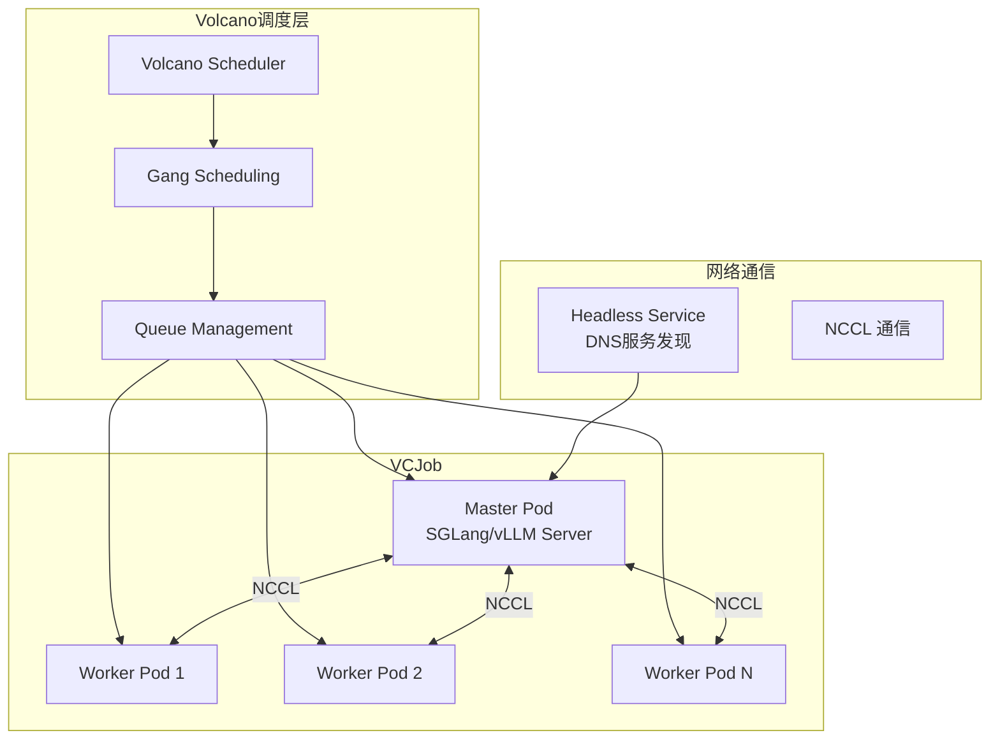
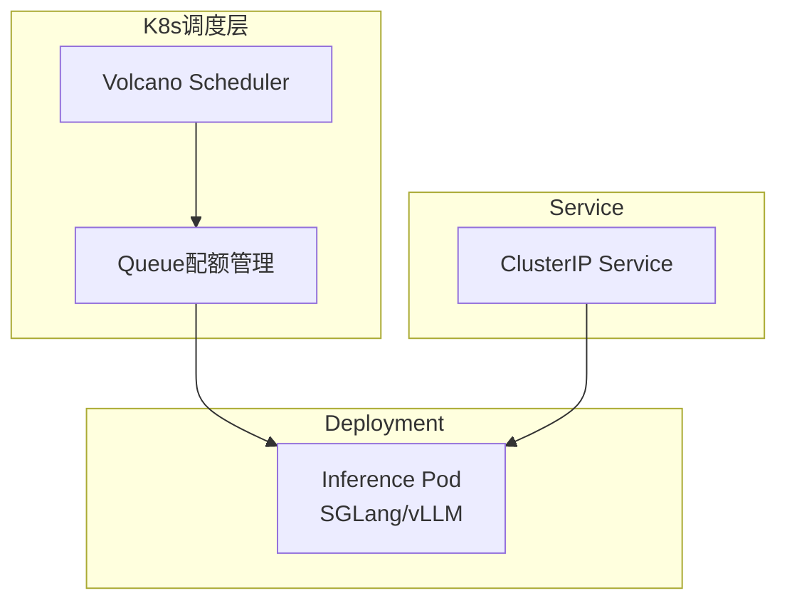
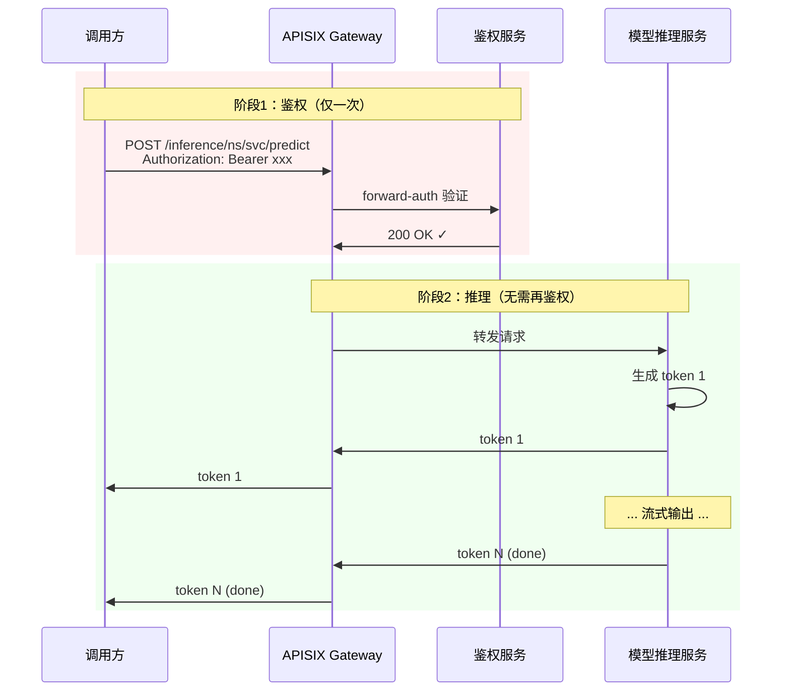
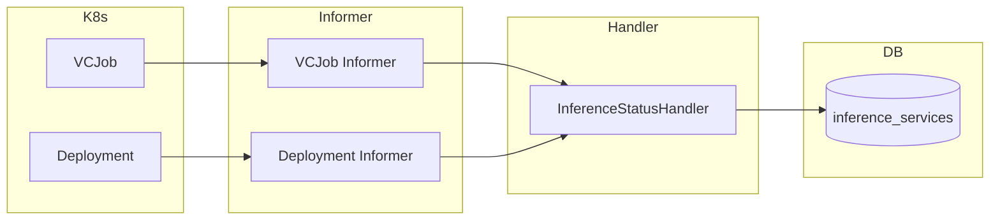

# 推理服务开发设计与实现方案

## 开发规范

项目结构分为 api router model service，所有的 router url 都以 api/v1 为起始，然后加业务名称，除了必须用 get 外，其余全部用 post。
所有的 service 入参的 req 和 response 结构体都要在 model 层的 request 和 response 创建，不要直接返回 db 的 model 字段。
db model 和其他 model 用 id 关联即可，model 创建完后需要在 initialize 中通过 gorm 的迁移方法自动迁移到数据库中。
工具放到对应的 utils 包中。
如无特殊要求，不要总结并创建文档。
所有的列表都需要有刷新按钮，并且 5s/10s 刷新一次请求。这个按钮全平台列表统一。
---

## 1. 概述

推理服务支持两种部署模式：

| 部署模式 | 调度方式 | 适用场景 | 框架支持 |
|---------|---------|---------|---------|
| **分布式推理** | Volcano VCJob | 超大模型 (70B+)，需要 TP/PP 并行 | SGLang, vLLM |
| **单体推理** | K8s Deployment | 中小模型 (7B-70B)，单卡或单机多卡 | SGLang, vLLM |

---

## 2. 系统架构

### 2.1 整体架构图

```mermaid
flowchart TB
    subgraph 调用方
        U1[Web/App 用户]
        U2[后端服务/第三方应用]
    end
    
    subgraph APISIX Gateway
        A1[HTTP Route<br/>/inference/{namespace}/{service}/*]
        A2{Auth 配置}
        A3[forward-auth 插件]
    end
    
    subgraph 后端服务
        B1[/api/v1/inference/auth<br/>JWT 认证]
        B2[/api/v1/inference/key-auth<br/>API Key 认证]
    end
    
    subgraph 推理服务
        C1[Distributed Inference<br/>Volcano VCJob]
        C2[Standalone Inference<br/>K8s Deployment]
    end
    
    U1 -->|Authorization| A1
    U2 -->|API-Key| A1
    A1 --> A2
    A2 -->|Authorization 模式| A3
    A2 -->|API-Key 模式| A3
    A3 -->|JWT Token| B1
    A3 -->|API Key| B2
    B1 -->|200 OK| A1
    B2 -->|200 OK| A1
    A1 -->|转发请求| C1
    A1 -->|转发请求| C2
```

### 2.2 分布式推理架构 (Volcano VCJob)



### 2.3 单体推理架构 (Deployment)



---

## 3. 数据模型设计

### 3.1 推理服务实体 (InferenceService)

```go
package inference

import (
    "time"
    "github.com/flipped-aurora/gin-vue-admin/server/global"
)

const (
    InferenceInstance = "inference"
)

// 部署类型常量
const (
    DeployTypeDistributed = "DISTRIBUTED" // 分布式推理 (VCJob)
    DeployTypeStandalone  = "STANDALONE"  // 单体推理 (Deployment)
)

// 推理框架常量
const (
    FrameworkSGLang = "SGLANG" // SGLang 框架
    FrameworkVLLM   = "VLLM"   // vLLM 框架
)

// 认证类型常量
const (
    AuthTypeJWT    = 1 // Authorization (JWT Token)
    AuthTypeApiKey = 2 // API-Key 认证
)

// 服务状态常量
const (
    ServiceStatusCreating  = "CREATING"  // 创建中
    ServiceStatusPending   = "PENDING"   // 等待调度
    ServiceStatusRunning   = "RUNNING"   // 运行中
    ServiceStatusFailed    = "FAILED"    // 失败
    ServiceStatusStopped   = "STOPPED"   // 已停止
    ServiceStatusDeleting  = "DELETING"  // 删除中
)

// 模型来源常量 (当前仅支持 PVC)
const (
    ModelSourcePVC = "PVC" // PVC 挂载
    // ModelSourceHuggingFace = "HUGGINGFACE" // 暂不支持
    // ModelSourceS3         = "S3"          // 暂不支持
)

// VolcanoJobStatusMap Volcano Job 状态映射表
var VolcanoJobStatusMap = map[string]string{
    "Pending":    ServiceStatusPending,
    "Running":    ServiceStatusRunning,
    "Succeeded":  ServiceStatusStopped,  // 推理服务不应是 Succeeded，视为停止
    "Failed":     ServiceStatusFailed,
    "Aborted":    ServiceStatusFailed,
    "Terminated": ServiceStatusStopped,
}

// DeploymentStatusMap Deployment 状态映射表
var DeploymentStatusMap = map[string]string{
    "Available":   ServiceStatusRunning,
    "Progressing": ServiceStatusPending,
    "Failed":      ServiceStatusFailed,
}

// InferenceService 推理服务数据库模型
type InferenceService struct {
    global.GVA_MODEL
    DisplayName       string     `json:"displayName" gorm:"column:display_name;type:varchar(63);not null;comment:展示名称"`
    InstanceName      string     `json:"instanceName" gorm:"column:instance_name;type:varchar(100);not null;uniqueIndex;comment:实例名称"`
    UserId            uint       `json:"userId" gorm:"column:user_id;not null;index;comment:用户ID"`
    Namespace         string     `json:"namespace" gorm:"column:namespace;type:varchar(63);not null;default:default;comment:命名空间"`
    ClusterID         uint       `json:"clusterId" gorm:"column:cluster_id;not null;index;comment:集群ID"`
    
    // 部署配置
    DeployType        string     `json:"deployType" gorm:"column:deploy_type;type:varchar(20);not null;comment:部署类型(DISTRIBUTED/STANDALONE)"`
    Framework         string     `json:"framework" gorm:"column:framework;type:varchar(20);not null;comment:推理框架(SGLANG/VLLM)"`
    
    // 模型配置 (当前仅支持 PVC 挂载)
    ModelPath         string     `json:"modelPath" gorm:"column:model_path;type:varchar(512);not null;comment:模型路径"`
    ModelPvcId        uint       `json:"modelPvcId" gorm:"column:model_pvc_id;not null;comment:模型PVC ID"`
    
    // 镜像配置
    ImageId           uint       `json:"imageId" gorm:"column:image_id;not null;comment:镜像ID"`
    
    // 并行配置 (分布式模式)
    TensorParallel    int        `json:"tensorParallel" gorm:"column:tensor_parallel;default:1;comment:张量并行度"`
    PipelineParallel  int        `json:"pipelineParallel" gorm:"column:pipeline_parallel;default:1;comment:流水线并行度"`
    WorkerCount       int        `json:"workerCount" gorm:"column:worker_count;default:0;comment:Worker数量"`
    
    // 资源配置
    ProductId         uint       `json:"productId" gorm:"column:product_id;comment:产品ID"`
    CPU               int64      `json:"cpu" gorm:"column:cpu;comment:CPU配置"`
    Memory            int64      `json:"memory" gorm:"column:memory;comment:内存配置(GiB)"`
    GPU               int64      `json:"gpu" gorm:"column:gpu;comment:单节点GPU数量"`
    GPUModel          string     `json:"gpuModel" gorm:"column:gpu_model;comment:GPU型号"`
    VGPUNumber        int64      `json:"vGpuNumber" gorm:"column:v_gpu_number;comment:vGPU数量;default:0"`
    VGPUMemory        int64      `json:"vGpuMemory" gorm:"column:v_gpu_memory;comment:vGPU显存 (GB);default:0"`
    VGPUCores         int64      `json:"vGpuCores" gorm:"column:v_gpu_cores;comment:vGPU核心数;default:0"`
    
    // 服务配置
    ServicePort       int        `json:"servicePort" gorm:"column:service_port;default:30000;comment:服务端口"`
    MaxTokens         int        `json:"maxTokens" gorm:"column:max_tokens;default:4096;comment:最大Token数"`
    ExtraArgs         string     `json:"extraArgs" gorm:"column:extra_args;type:text;comment:额外启动参数(JSON格式)"`
    
    // 并发控制
    MaxConcurrency    int        `json:"maxConcurrency" gorm:"column:max_concurrency;default:0;comment:最大并发请求数(0不限制)"`
    MaxBatchSize      int        `json:"maxBatchSize" gorm:"column:max_batch_size;default:0;comment:最大批处理大小"`
    
    // 自愈配置 (分布式模式)
    AutoRestart       bool       `json:"autoRestart" gorm:"column:auto_restart;default:false;comment:是否允许自动重启"`
    RestartCount      int        `json:"restartCount" gorm:"column:restart_count;default:0;comment:已重启次数"`
    MaxRestarts       int        `json:"maxRestarts" gorm:"column:max_restarts;default:3;comment:最大重启次数"`
    
    // 认证配置
    AuthType          int        `json:"authType" gorm:"column:auth_type;default:1;comment:认证类型 1-Authorization 2-API-Key"`
    
    // 状态信息
    Status            string     `json:"status" gorm:"column:status;type:varchar(50);not null;default:CREATING;index;comment:状态"`
    ErrorMsg          string     `json:"errorMsg" gorm:"column:error_msg;type:text;comment:错误信息"`
    K8sResourceUid    string     `json:"k8sResourceUid" gorm:"column:k8s_resource_uid;type:varchar(128);index;comment:K8s资源UID"`
    K8sResourceName   string     `json:"k8sResourceName" gorm:"column:k8s_resource_name;type:varchar(128);comment:K8s资源名称"`
    
    // 时间信息
    StartedAt         *time.Time `json:"startedAt" gorm:"column:started_at;comment:启动时间"`
    
    // 计费相关
    PayType           int64      `json:"payType" gorm:"column:pay_type;default:1;comment:付费类型(1-按量 2-包日 3-包周 4-包月)"`
    Price             float64    `json:"price" gorm:"column:price;type:decimal(10,4);comment:单价"`
    OrderId           uint       `json:"orderId" gorm:"column:order_id;comment:关联订单ID"`
}

func (InferenceService) TableName() string {
    return "inference_services"
}
```

### 3.2 推理服务挂载配置

```go
// InferenceMount 推理服务挂载配置
type InferenceMount struct {
    global.GVA_MODEL
    ServiceId   uint   `json:"serviceId" gorm:"column:service_id;not null;index;comment:关联的推理服务ID"`
    MountType   string `json:"mountType" gorm:"column:mount_type;type:varchar(20);comment:挂载类型(MODEL/DATA)"`
    PvcId       uint   `json:"pvcId" gorm:"column:pvc_id;comment:PVC ID"`
    PvcName     string `json:"pvcName" gorm:"column:pvc_name;type:varchar(255);comment:PVC名称"`
    SubPath     string `json:"subPath" gorm:"column:sub_path;type:varchar(255);default:'';comment:PVC内子路径"`
    MountPath   string `json:"mountPath" gorm:"column:mount_path;type:varchar(512);not null;comment:容器内挂载路径"`
    ReadOnly    bool   `json:"readOnly" gorm:"column:read_only;default:true;comment:是否只读"`
}

func (InferenceMount) TableName() string {
    return "inference_mounts"
}
```

### 3.3 API Key 实体

```go
// InferenceApiKey API Key 实体
type InferenceApiKey struct {
    global.GVA_MODEL
    ServiceId   uint       `json:"serviceId" gorm:"column:service_id;not null;index;comment:关联的推理服务ID"`
    ApiKey      string     `json:"apiKey" gorm:"column:api_key;type:varchar(64);not null;uniqueIndex;comment:API Key"`
    Name        string     `json:"name" gorm:"column:name;type:varchar(100);comment:Key名称"`
    Description string     `json:"description" gorm:"column:description;type:varchar(500);comment:描述"`
    Status      string     `json:"status" gorm:"column:status;type:varchar(20);default:'active';comment:状态(active/disabled)"`
    Scopes      string     `json:"scopes" gorm:"column:scopes;type:varchar(100);default:'read,write';comment:权限范围(read,write)"`
    RateLimit   int        `json:"rateLimit" gorm:"column:rate_limit;default:0;comment:每分钟请求限制(0表示不限制)"`
    LastUsedAt  *time.Time `json:"lastUsedAt" gorm:"column:last_used_at;comment:最后使用时间"`
    ExpiredAt   *time.Time `json:"expiredAt" gorm:"column:expired_at;comment:过期时间"`
    UserId      uint       `json:"userId" gorm:"column:user_id;not null;index;comment:创建者用户ID"`
}

func (InferenceApiKey) TableName() string {
    return "inference_api_keys"
}
```

### 3.4 环境变量实体

```go
// InferenceEnv 推理服务环境变量
type InferenceEnv struct {
    global.GVA_MODEL
    ServiceId uint   `json:"serviceId" gorm:"column:service_id;not null;index;comment:关联的推理服务ID"`
    Name      string `json:"name" gorm:"column:name;type:varchar(255);not null;comment:环境变量名"`
    Value     string `json:"value" gorm:"column:value;type:text;comment:环境变量值"`
}

func (InferenceEnv) TableName() string {
    return "inference_envs"
}
```

### 3.5 API Key 权限策略 (可扩展)

```go
// InferenceApiKeyPolicy API Key 权限策略
// 支持一个 Key 访问多个服务，每个服务可配置不同权限
type InferenceApiKeyPolicy struct {
    global.GVA_MODEL
    ApiKeyId  uint   `json:"apiKeyId" gorm:"column:api_key_id;not null;index;comment:关联的API Key ID"`
    ServiceId uint   `json:"serviceId" gorm:"column:service_id;not null;index;comment:关联的服务ID(0表示所有服务)"`
    Actions   string `json:"actions" gorm:"column:actions;type:varchar(100);default:'inference';comment:允许的操作(inference,read,write)"`
}

func (InferenceApiKeyPolicy) TableName() string {
    return "inference_api_key_policies"
}
```

**权限扩展说明：**
- 当前实现：`ApiKey.ServiceId` 直接绑定单个服务
- 扩展方式：通过 `InferenceApiKeyPolicy` 表实现多服务绑定
- 兼容策略：认证时优先查 Policy 表，fallback 到 Key.ServiceId

---

## 4. Request/Response 结构

### 4.1 创建推理服务请求

```go
package request

// CreateInferenceServiceReq 创建推理服务请求
type CreateInferenceServiceReq struct {
    Name              string                    `json:"name" binding:"required"`              // 服务名称
    DeployType        string                    `json:"deployType" binding:"required"`        // 部署类型: DISTRIBUTED/STANDALONE
    Framework         string                    `json:"framework" binding:"required"`         // 框架: SGLANG/VLLM
    
    // 模型配置 (当前仅支持 PVC)
    ModelPath         string                    `json:"modelPath" binding:"required"`         // 模型路径
    ModelPvcId        uint                      `json:"modelPvcId" binding:"required"`        // 模型PVC ID
    
    // 镜像和产品
    ImageId           uint                      `json:"imageId" binding:"required"`           // 镜像ID
    ProductId         uint                      `json:"productId" binding:"required"`         // 产品ID
    
    // 并行配置 (分布式模式必填)
    TensorParallel    int                       `json:"tensorParallel"`                       // 张量并行度
    PipelineParallel  int                       `json:"pipelineParallel"`                     // 流水线并行度
    WorkerCount       int                       `json:"workerCount"`                          // Worker数量
    
    // 服务配置
    ServicePort       int                       `json:"servicePort"`                          // 服务端口，默认30000
    MaxTokens         int                       `json:"maxTokens"`                            // 最大Token数
    ExtraArgs         []string                  `json:"extraArgs"`                            // 额外启动参数
    
    // 并发控制
    MaxConcurrency    int                       `json:"maxConcurrency"`                       // 最大并发请求数(0不限制)
    MaxBatchSize      int                       `json:"maxBatchSize"`                         // 最大批处理大小
    
    // 自愈配置 (分布式模式)
    AutoRestart       bool                      `json:"autoRestart"`                          // 是否允许自动重启
    MaxRestarts       int                       `json:"maxRestarts"`                          // 最大重启次数，默认3
    
    // 认证配置
    AuthType          int                       `json:"authType"`                             // 认证类型 1-JWT 2-API-Key
    
    // 挂载配置
    Mounts            []CreateInferenceMountReq `json:"mounts"`                               // 额外挂载配置
    
    // 环境变量
    Envs              []CreateInferenceEnvReq   `json:"envs"`                                 // 环境变量
    
    // 计费
    PayType           int64                     `json:"payType"`                              // 付费类型
    UserId            uint                      `json:"userId"`                               // 用户ID (由后端填充)
}

// CreateInferenceMountReq 挂载配置请求
type CreateInferenceMountReq struct {
    MountType   string `json:"mountType"`   // 挂载类型: MODEL/DATA
    PvcId       uint   `json:"pvcId"`       // PVC ID
    SubPath     string `json:"subPath"`     // 子路径
    MountPath   string `json:"mountPath"`   // 容器内挂载路径
    ReadOnly    bool   `json:"readOnly"`    // 是否只读
}

// CreateInferenceEnvReq 环境变量请求
type CreateInferenceEnvReq struct {
    Name  string `json:"name"`  // 环境变量名
    Value string `json:"value"` // 环境变量值
}
```

### 4.2 其他请求结构

```go
// GetInferenceServiceListReq 获取推理服务列表请求
type GetInferenceServiceListReq struct {
    Page       int    `json:"page" form:"page"`
    PageSize   int    `json:"pageSize" form:"pageSize"`
    Name       string `json:"name" form:"name"`                 // 名称模糊搜索
    Status     string `json:"status" form:"status"`             // 状态筛选
    DeployType string `json:"deployType" form:"deployType"`     // 部署类型筛选
    Framework  string `json:"framework" form:"framework"`       // 框架筛选
    UserId     uint   `json:"userId" form:"userId"`             // 用户ID
}

// DeleteInferenceServiceReq 删除推理服务请求
type DeleteInferenceServiceReq struct {
    ID uint `json:"id" binding:"required"`
}

// StopInferenceServiceReq 停止推理服务请求
type StopInferenceServiceReq struct {
    ID uint `json:"id" binding:"required"`
}

// GetInferenceServiceDetailReq 获取推理服务详情请求
type GetInferenceServiceDetailReq struct {
    ID uint `json:"id" form:"id" binding:"required"`
}

// GetInferenceServiceLogsReq 获取推理服务日志请求
type GetInferenceServiceLogsReq struct {
    ID         uint   `json:"id" form:"id" binding:"required"`
    TaskName   string `json:"taskName" form:"taskName"`      // Task名称 (master/worker)
    PodIndex   *int   `json:"podIndex" form:"podIndex"`      // Pod索引
    Container  string `json:"container" form:"container"`    // 容器名称
    TailLines  int64  `json:"tailLines" form:"tailLines"`    // 尾部行数
    Follow     bool   `json:"follow" form:"follow"`          // 是否实时跟踪
}
```

### 4.3 API Key 相关请求

```go
// CreateApiKeyReq 创建 API Key 请求
type CreateApiKeyReq struct {
    ServiceId   uint   `json:"serviceId" binding:"required"` // 推理服务ID
    Name        string `json:"name" binding:"required"`      // Key名称
    Description string `json:"description"`                  // 描述
    ExpireDays  int    `json:"expireDays"`                   // 过期天数，0表示永不过期
}

// ListApiKeysReq 获取 API Key 列表请求
type ListApiKeysReq struct {
    ServiceId uint `json:"serviceId" form:"serviceId" binding:"required"`
    Page      int  `json:"page" form:"page"`
    PageSize  int  `json:"pageSize" form:"pageSize"`
}

// DeleteApiKeyReq 删除 API Key 请求
type DeleteApiKeyReq struct {
    ID uint `json:"id" binding:"required"`
}
```

### 4.4 Response 结构

```go
package response

import "time"

// CreateInferenceServiceResp 创建推理服务响应
type CreateInferenceServiceResp struct {
    ID           uint   `json:"id"`
    InstanceName string `json:"instanceName"`
    Status       string `json:"status"`
    AccessUrl    string `json:"accessUrl"` // 访问地址
}

// GetInferenceServiceListResp 获取推理服务列表响应
type GetInferenceServiceListResp struct {
    Total int64                       `json:"total"`
    List  []InferenceServiceListItem  `json:"list"`
}

// InferenceServiceListItem 列表项
type InferenceServiceListItem struct {
    ID            uint       `json:"id"`
    DisplayName   string     `json:"displayName"`
    InstanceName  string     `json:"instanceName"`
    DeployType    string     `json:"deployType"`
    Framework     string     `json:"framework"`
    Status        string     `json:"status"`
    GPU           int64      `json:"gpu"`
    GPUModel      string     `json:"gpuModel"`
    CreatedAt     time.Time  `json:"createdAt"`
    StartedAt     *time.Time `json:"startedAt"`
}

// InferenceServiceDetail 推理服务详情
type InferenceServiceDetail struct {
    ID               uint                  `json:"id"`
    DisplayName      string                `json:"displayName"`
    InstanceName     string                `json:"instanceName"`
    Namespace        string                `json:"namespace"`
    DeployType       string                `json:"deployType"`
    Framework        string                `json:"framework"`
    ModelSource      string                `json:"modelSource"`
    ModelPath        string                `json:"modelPath"`
    ImageName        string                `json:"imageName"`
    TensorParallel   int                   `json:"tensorParallel"`
    PipelineParallel int                   `json:"pipelineParallel"`
    WorkerCount      int                   `json:"workerCount"`
    CPU              int64                 `json:"cpu"`
    Memory           int64                 `json:"memory"`
    GPU              int64                 `json:"gpu"`
    GPUModel         string                `json:"gpuModel"`
    ServicePort      int                   `json:"servicePort"`
    MaxTokens        int                   `json:"maxTokens"`
    ExtraArgs        []string              `json:"extraArgs"`
    AuthType         int                   `json:"authType"`
    Status           string                `json:"status"`
    ErrorMsg         string                `json:"errorMsg"`
    AccessUrl        string                `json:"accessUrl"`
    CreatedAt        time.Time             `json:"createdAt"`
    StartedAt        *time.Time            `json:"startedAt"`
    Mounts           []InferenceMountItem  `json:"mounts"`
    Envs             []InferenceEnvItem    `json:"envs"`
}

// InferenceMountItem 挂载项
type InferenceMountItem struct {
    MountType string `json:"mountType"`
    PvcName   string `json:"pvcName"`
    SubPath   string `json:"subPath"`
    MountPath string `json:"mountPath"`
    ReadOnly  bool   `json:"readOnly"`
}

// InferenceEnvItem 环境变量项
type InferenceEnvItem struct {
    Name  string `json:"name"`
    Value string `json:"value"`
}

// AuthResult 认证结果
type AuthResult struct {
    Valid     bool   `json:"valid"`
    UserId    uint   `json:"userId"`
    ServiceId uint   `json:"serviceId"`
    Message   string `json:"message,omitempty"`
}

// CreateApiKeyResp 创建 API Key 响应
type CreateApiKeyResp struct {
    ID     uint   `json:"id"`
    ApiKey string `json:"apiKey"` // 仅创建时返回完整 Key
    Name   string `json:"name"`
}

// ListApiKeysResp 获取 API Key 列表响应
type ListApiKeysResp struct {
    Total int64          `json:"total"`
    List  []ApiKeyItem   `json:"list"`
}

// ApiKeyItem API Key 列表项
type ApiKeyItem struct {
    ID          uint       `json:"id"`
    Name        string     `json:"name"`
    ApiKey      string     `json:"apiKey"`      // 脱敏显示，如 sk-***abc
    Description string     `json:"description"`
    Status      string     `json:"status"`
    Scopes      string     `json:"scopes"`
    RateLimit   int        `json:"rateLimit"`
    LastUsedAt  *time.Time `json:"lastUsedAt"`
    ExpiredAt   *time.Time `json:"expiredAt"`
    CreatedAt   time.Time  `json:"createdAt"`
}
```

---

## 5. Service 层设计

### 5.1 接口定义

```go
package inference

import (
    "context"
    "io"
    
    "github.com/flipped-aurora/gin-vue-admin/server/model/inference/request"
    "github.com/flipped-aurora/gin-vue-admin/server/model/inference/response"
    terminalService "gin-vue-admin/service/terminal"
)

// InferenceServiceManager 推理服务管理器接口
type InferenceServiceManager interface {
    // 服务管理
    CreateInferenceService(ctx context.Context, req *request.CreateInferenceServiceReq) (*response.CreateInferenceServiceResp, error)
    DeleteInferenceService(ctx context.Context, req *request.DeleteInferenceServiceReq) error
    StopInferenceService(ctx context.Context, req *request.StopInferenceServiceReq) error
    StartInferenceService(ctx context.Context, req *request.StartInferenceServiceReq) error
    GetInferenceServiceList(ctx context.Context, req *request.GetInferenceServiceListReq) (*response.GetInferenceServiceListResp, error)
    GetInferenceServiceDetail(ctx context.Context, req *request.GetInferenceServiceDetailReq) (*response.InferenceServiceDetail, error)
    GetInferenceServiceLogs(ctx context.Context, req *request.GetInferenceServiceLogsReq) (io.ReadCloser, error)
    GetInferenceServicePods(ctx context.Context, id uint) ([]terminalService.PodInfo, error)
}
```

### 5.2 认证服务接口

```go
// InferenceAuthService 认证服务接口
type InferenceAuthService interface {
    // JWT Token 认证 (供 APISIX forward-auth 调用)
    AuthByToken(ctx context.Context, token, namespace, serviceName string) (*response.AuthResult, error)
    
    // API Key 认证 (供 APISIX forward-auth 调用)
    AuthByApiKey(ctx context.Context, apiKey, namespace, serviceName string) (*response.AuthResult, error)
    
    // API Key 管理
    CreateApiKey(ctx context.Context, req *request.CreateApiKeyReq) (*response.CreateApiKeyResp, error)
    ListApiKeys(ctx context.Context, req *request.ListApiKeysReq) (*response.ListApiKeysResp, error)
    DeleteApiKey(ctx context.Context, req *request.DeleteApiKeyReq) error
}
```

### 5.3 服务实现结构

```go
var _ InferenceServiceManager = (*InferenceService)(nil)

// InferenceService 推理服务实现
type InferenceService struct {
    apisixSvc interface{} // APISIX 服务接口
}

var InferenceServiceApp = new(InferenceService)
```

---

## 6. Builder 模式设计

### 6.1 Builder 接口

参考 training service 的 builder 模式，为推理服务实现 builder：

```go
package builder

import (
    inferenceReq "gin-vue-admin/model/inference/request"
    appsv1 "k8s.io/api/apps/v1"
    vcbatch "volcano.sh/apis/pkg/apis/batch/v1alpha1"
)

// InferenceBuilder 推理服务构建器接口
type InferenceBuilder interface {
    // BuildVCJob 构建 Volcano Job (分布式推理)
    BuildVCJob(spec *inferenceReq.InferenceSpec) (*vcbatch.Job, error)
    // BuildDeployment 构建 Deployment (单体推理)
    BuildDeployment(spec *inferenceReq.InferenceSpec) (*appsv1.Deployment, error)
}

// FrameworkStrategy 框架策略接口
// 不同的推理框架 (SGLang, vLLM) 实现不同的策略
type FrameworkStrategy interface {
    // GetCommand 获取启动命令
    GetCommand(spec *inferenceReq.InferenceSpec) ([]string, []string)
    // GetEnvVars 获取环境变量
    GetEnvVars(spec *inferenceReq.InferenceSpec) []corev1.EnvVar
    // GetPorts 获取端口配置
    GetPorts(spec *inferenceReq.InferenceSpec) []corev1.ContainerPort
}
```

### 6.2 框架策略实现

```go
// SGLangStrategy SGLang 框架策略
type SGLangStrategy struct{}

func (s *SGLangStrategy) GetCommand(spec *inferenceReq.InferenceSpec) ([]string, []string) {
    command := []string{"python3", "-m", "sglang.launch_server"}
    args := []string{
        "--model-path", spec.ModelPath,
        "--host", "0.0.0.0",
        "--port", fmt.Sprintf("%d", spec.ServicePort),
        "--tp", fmt.Sprintf("%d", spec.TensorParallel),
    }
    if spec.MaxTokens > 0 {
        args = append(args, "--max-total-tokens", fmt.Sprintf("%d", spec.MaxTokens))
    }
    // 追加用户自定义参数
    if len(spec.ExtraArgs) > 0 {
        args = append(args, spec.ExtraArgs...)
    }
    return command, args
}

// VLLMStrategy vLLM 框架策略
type VLLMStrategy struct{}

func (v *VLLMStrategy) GetCommand(spec *inferenceReq.InferenceSpec) ([]string, []string) {
    command := []string{"python3", "-m", "vllm.entrypoints.openai.api_server"}
    args := []string{
        "--model", spec.ModelPath,
        "--host", "0.0.0.0",
        "--port", fmt.Sprintf("%d", spec.ServicePort),
        "--tensor-parallel-size", fmt.Sprintf("%d", spec.TensorParallel),
    }
    if spec.MaxTokens > 0 {
        args = append(args, "--max-model-len", fmt.Sprintf("%d", spec.MaxTokens))
    }
    // 追加用户自定义参数
    if len(spec.ExtraArgs) > 0 {
        args = append(args, spec.ExtraArgs...)
    }
    return command, args
}
```

### 6.3 Builder 工厂

```go
// NewInferenceBuilder 根据框架类型创建对应的 Builder
func NewInferenceBuilder(framework string) InferenceBuilder {
    var strategy FrameworkStrategy
    switch framework {
    case "SGLANG":
        strategy = &SGLangStrategy{}
    case "VLLM":
        strategy = &VLLMStrategy{}
    default:
        strategy = &SGLangStrategy{}
    }
    return &BaseBuilder{Strategy: strategy}
}
```

### 6.4 模型 Volume 配置

当前仅支持 PVC 挂载方式：

```go
// buildModelVolume 构建模型 Volume 配置 (仅 PVC)
func buildModelVolume(spec *inferenceReq.InferenceSpec) ([]corev1.Volume, []corev1.VolumeMount) {
    volumes := []corev1.Volume{
        {
            Name: "model",
            VolumeSource: corev1.VolumeSource{
                PersistentVolumeClaim: &corev1.PersistentVolumeClaimVolumeSource{
                    ClaimName: spec.ModelPvcName,
                },
            },
        },
    }
    
    mounts := []corev1.VolumeMount{
        {
            Name:      "model",
            MountPath: "/model",
            SubPath:   spec.ModelSubPath,
            ReadOnly:  true,
        },
    }
    
    return volumes, mounts
}
```

> **注意**：HuggingFace / S3 模型来源暂不支持。如需使用外部模型，请先通过其他方式下载到 PVC 后再创建推理服务。

---

## 7. VCJob 模板 (分布式推理)

### 7.1 SGLang 分布式 VCJob

```yaml
apiVersion: batch.volcano.sh/v1alpha1
kind: Job
metadata:
  name: inference-{instance-name}
  namespace: {namespace}
  labels:
    app.kubernetes.io/managed-by: neptune
    neptune.io/instance: {instance-name}
    neptune.io/type: inference
    neptune.io/framework: sglang
spec:
  schedulerName: volcano
  minAvailable: {1 + worker_count}  # Gang Scheduling
  queue: default
  
  plugins:
    svc: ["--publish-not-ready-addresses"]
    env: []
    
  tasks:
    # Master 任务
    - name: master
      replicas: 1
      template:
        metadata:
          labels:
            app: inference-{instance-name}
            role: master
        spec:
          restartPolicy: OnFailure
          containers:
            - name: inference
              image: {image}
              command: ["python3", "-m", "sglang.launch_server"]
              args:
                - "--model-path"
                - "{model_path}"
                - "--tp"
                - "{tensor_parallel}"
                - "--nccl-init-addr"
                - "$(hostname -i):5000"
                - "--host"
                - "0.0.0.0"
                - "--port"
                - "30000"
              env:
                - name: NCCL_SOCKET_IFNAME
                  value: "eth0"
              resources:
                limits:
                  nvidia.com/gpu: {gpu_per_node}
                  cpu: {cpu}
                  memory: {memory}Gi
              ports:
                - containerPort: 30000  # HTTP 服务端口
                - containerPort: 5000   # NCCL 通信端口
              volumeMounts:
                - name: model
                  mountPath: /model
                  readOnly: true
                - name: shm
                  mountPath: /dev/shm
              # 健康检查（确保 Service 不会将流量转发给未就绪的 Pod）
              readinessProbe:
                httpGet:
                  path: /health
                  port: 30000
                initialDelaySeconds: 60
                periodSeconds: 10
              livenessProbe:
                httpGet:
                  path: /health
                  port: 30000
                initialDelaySeconds: 120
                periodSeconds: 30
          volumes:
            - name: model
              persistentVolumeClaim:
                claimName: {model_pvc_name}
            - name: shm
              emptyDir:
                medium: Memory
                sizeLimit: 16Gi
                
    # Worker 任务
    - name: worker
      replicas: {worker_count}
      template:
        metadata:
          labels:
            app: inference-{instance-name}
            role: worker
        spec:
          restartPolicy: OnFailure
          containers:
            - name: inference
              image: {image}
              command: ["/bin/bash", "-c"]
              args:
                - |
                  export NCCL_SOCKET_IFNAME=eth0
                  until nslookup master-0.inference-{instance-name}; do sleep 2; done
                  python3 -m sglang.launch_server \
                    --model-path {model_path} \
                    --tp {tensor_parallel} \
                    --nccl-init-addr master-0.inference-{instance-name}:5000 \
                    --address $(hostname -i)
              resources:
                limits:
                  nvidia.com/gpu: {gpu_per_node}
                  cpu: {cpu}
                  memory: {memory}Gi
              volumeMounts:
                - name: model
                  mountPath: /model
                  readOnly: true
                - name: shm
                  mountPath: /dev/shm
          # 软反亲和性：尽量分散到不同节点
          affinity:
            podAntiAffinity:
              preferredDuringSchedulingIgnoredDuringExecution:
              - weight: 100
                podAffinityTerm:
                  labelSelector:
                    matchLabels:
                      app: inference-{instance-name}
                  topologyKey: kubernetes.io/hostname
          volumes:
            - name: model
              persistentVolumeClaim:
                claimName: {model_pvc_name}
            - name: shm
              emptyDir:
                medium: Memory
                sizeLimit: 16Gi
```

---

## 8. Deployment 模板 (单体推理)

```yaml
apiVersion: apps/v1
kind: Deployment
metadata:
  name: inference-{instance-name}
  namespace: {namespace}
  labels:
    app.kubernetes.io/managed-by: neptune
    neptune.io/instance: {instance-name}
    neptune.io/type: inference
    neptune.io/framework: sglang
spec:
  replicas: 1
  selector:
    matchLabels:
      app: inference-{instance-name}
  template:
    metadata:
      labels:
        app: inference-{instance-name}
    spec:
      schedulerName: volcano  # 统一使用 Volcano 管理队列配额
      containers:
      - name: inference
        image: {image}
        command: ["python3", "-m", "sglang.launch_server"]
        args:
          - "--model-path"
          - "{model_path}"
          - "--tp"
          - "{tensor_parallel}"
          - "--host"
          - "0.0.0.0"
          - "--port"
          - "30000"
        resources:
          limits:
            nvidia.com/gpu: {gpu}
            cpu: {cpu}
            memory: {memory}Gi
          requests:
            nvidia.com/gpu: {gpu}
            cpu: {cpu}
            memory: {memory}Gi
        ports:
        - containerPort: 30000
        volumeMounts:
          - name: model
            mountPath: /model
            readOnly: true
          - name: shm
            mountPath: /dev/shm
        readinessProbe:
          httpGet:
            path: /health
            port: 30000
          initialDelaySeconds: 60
          periodSeconds: 10
        livenessProbe:
          httpGet:
            path: /health
            port: 30000
          initialDelaySeconds: 120
          periodSeconds: 30
      volumes:
        - name: model
          persistentVolumeClaim:
            claimName: {model_pvc_name}
        - name: shm
          emptyDir:
            medium: Memory
            sizeLimit: 16Gi
      tolerations:
        - key: "nvidia.com/gpu"
          operator: "Exists"
          effect: "NoSchedule"
---
apiVersion: v1
kind: Service
metadata:
  name: inference-{instance-name}
  namespace: {namespace}
spec:
  selector:
    app: inference-{instance-name}
  ports:
    - protocol: TCP
      port: 80
      targetPort: 30000
  type: ClusterIP
```

---

## 9. Auth 配置设计

### 9.1 认证方式

| 认证方式 | Header 名称 | 适用场景 |
|---------|------------|---------|
| **Authorization** | `Authorization: Bearer <jwt-token>` | 用户通过 Web/App 调用自己的模型服务 |
| **API-Key** | `API-Key: <api-key>` | 后端服务、第三方应用通过 API Key 调用 |

### 9.2 鉴权流程



### 9.3 APISIX 路由配置（通配符方案）

**设计原则：全局只需 1 条 Route，避免路由规模膨胀**

当推理服务数量增多时（如 1000+），每个服务一条 ApisixRoute 会导致：
- etcd 配置膨胀
- 路由热更新变慢
- Controller 同步压力增大

**解决方案：使用通配符路由 + 动态 Upstream**

```yaml
# 全局唯一的推理服务入口路由
apiVersion: apisix.apache.org/v2
kind: ApisixRoute
metadata:
  name: inference-gateway  # 全局唯一
  namespace: apisix
spec:
  ingressClassName: apisix
  http:
    - name: inference-proxy
      match:
        paths:
          - /inference/*  # 通配符匹配所有推理服务
      backends:
        - serviceName: inference-router  # 占位，实际由 proxy-rewrite 动态设置
          servicePort: 80
      plugins:
        # 1. 认证插件：验证权限并返回真实后端地址
        - name: forward-auth
          enable: true
          config:
            uri: "/api/v1/inference/auth"
            request_headers: ["Authorization", "API-Key"]
            upstream_headers: ["X-User-Id", "X-Service-Id", "X-Upstream-Host", "X-Upstream-Port"]
        # 2. 动态路由：根据认证服务返回的 Header 重写 upstream
        - name: proxy-rewrite
          enable: true
          config:
            host: "$upstream_header_x_upstream_host"
```

**后端认证服务逻辑：**

```go
// AuthByToken 认证并返回动态 upstream
func (a *InferenceAuthService) AuthByToken(ctx *gin.Context) {
    // 1. 解析路径 /inference/{namespace}/{service}/...
    path := ctx.Request.URL.Path
    parts := strings.Split(path, "/")
    namespace, serviceName := parts[2], parts[3]
    
    // 2. 验证用户权限
    token := ctx.GetHeader("Authorization")
    userId, err := validateJWT(token)
    if err != nil {
        ctx.AbortWithStatus(401)
        return
    }
    
    // 3. 查询服务信息
    service, err := getServiceByName(namespace, serviceName)
    if err != nil || service.UserId != userId {
        ctx.AbortWithStatus(403)
        return
    }
    
    // 4. 返回动态 upstream 地址（通过响应头）
    upstreamHost := fmt.Sprintf("inference-%s.%s.svc", serviceName, namespace)
    ctx.Header("X-Upstream-Host", upstreamHost)
    ctx.Header("X-User-Id", fmt.Sprintf("%d", userId))
    ctx.Header("X-Service-Id", fmt.Sprintf("%d", service.ID))
    ctx.Status(200)
}
```

**优势：**
- 全局只有 **1 条 ApisixRoute**
- 新增推理服务 = 数据库插入 + 创建 K8s Service（无需操作 APISIX）
- etcd 压力极小，路由热更新快

---

## 10. API 接口列表

| 接口 | 方法 | 说明 |
|------|------|------|
| `/api/v1/inference/services` | POST | 创建推理服务 |
| `/api/v1/inference/services` | DELETE | 删除推理服务 |
| `/api/v1/inference/services/list` | POST | 获取推理服务列表 |
| `/api/v1/inference/services/detail` | GET | 获取推理服务详情 |
| `/api/v1/inference/services/stop` | POST | 停止推理服务 |
| `/api/v1/inference/services/start` | POST | 启动推理服务 |
| `/api/v1/inference/services/logs` | GET | 获取推理服务日志 |
| `/api/v1/inference/services/pods` | GET | 获取推理服务Pod列表 |
| `/api/v1/inference/auth` | POST | JWT Token 认证 (APISIX forward-auth) |
| `/api/v1/inference/key-auth` | POST | API Key 认证 (APISIX forward-auth) |
| `/api/v1/inference/keys` | POST | 创建 API Key |
| `/api/v1/inference/keys/list` | POST | 获取 API Key 列表 |
| `/api/v1/inference/keys` | DELETE | 删除 API Key |

---

## 11. 文件结构

```
server/
├── api/v1/inference/
│   ├── inference.go          # 推理服务 API
│   └── auth.go               # 认证 API
├── model/inference/
│   ├── inference.go          # 数据模型
│   ├── request/
│   │   └── request.go        # 请求结构
│   └── response/
│       └── response.go       # 响应结构
├── router/inference/
│   └── inference.go          # 路由定义
└── service/inference/
    ├── inference.go          # 服务实现
    ├── auth.go               # 认证服务实现
    ├── enter.go              # 服务入口
    └── builder/
        ├── builder.go        # Builder 接口
        ├── sglang_builder.go # SGLang Builder
        └── vllm_builder.go   # vLLM Builder
```

---

## 12. 开发优先级

### Phase 1: 基础功能
1. [x] 数据模型设计
2. [ ] 单体推理服务 (Deployment)
3. [ ] 基础 CRUD API
4. [ ] APISIX 路由集成

### Phase 2: 分布式推理
5. [ ] Volcano VCJob Builder
6. [ ] 分布式推理服务创建
7. [ ] Gang Scheduling 验证
8. [ ] NCCL 通信测试

### Phase 3: 认证与安全
9. [ ] JWT Token 认证
10. [ ] API Key 管理
11. [ ] forward-auth 集成

### Phase 4: 运维功能
12. [ ] 日志查看
13. [ ] Pod 状态监控
14. [ ] 服务启停控制
15. [ ] 计费集成

---

## 13. 注意事项

### 13.1 网络与服务发现

- **分布式模式**：VCJob 配置 `plugins.svc` 后，Volcano 会自动维护 Headless Service
- **调试方法**：如果 Worker 报错 Connection refused，进入 Pod 用 `nslookup master-0.job-name` 测试 DNS

### 13.2 调度与死锁

- **Gang Scheduling**：务必设置 `minAvailable` 等于 Master + Worker 总数
- **效果**：资源不够时，Volcano 会让所有 Pod 保持 Pending，避免资源死锁

### 13.3 亲和性配置

- **开发/测试环境**：使用 `preferredDuringScheduling`（软亲和）
- **生产环境**：使用 `requiredDuringScheduling`（硬亲和）获得最大带宽

### 13.4 端口暴露

- VCJob 默认没有 Service 负载均衡
- 需要手动创建 Service，selector 指向 `role: master` 的 label

---

## 14. 资源生命周期管理

### 14.1 停止 vs 启动 vs 删除

推理服务的资源管理遵循以下策略，确保快速启停且无残留：

| 操作 | 计算资源 (VCJob/Deployment) | 网络资源 (APISIX Route, Service) | 数据资源 (Secret, PVC) |
|------|---------------------------|--------------------------------|----------------------|
| **创建** | ✅ 创建 | ✅ 创建 | ✅ 创建 |
| **停止** | ✅ 删除/缩容 | ❌ 保留 | ❌ 保留 |
| **启动** | ✅ 重新创建/扩容 | ❌ 已存在，无需操作 | ❌ 已存在，无需操作 |
| **删除** | ✅ 删除 | ✅ 删除 | ✅ 删除 |

### 14.2 停止服务逻辑

```go
func (s *InferenceService) StopInferenceService(ctx context.Context, req *request.StopInferenceServiceReq) error {
    // 1. 查询服务信息
    service, err := s.getServiceById(req.ID)
    if err != nil {
        return err
    }
    
    // 2. 根据部署类型执行停止
    switch service.DeployType {
    case DeployTypeDistributed:
        // 删除 Volcano Job（Pod 会自动清理）
        err = s.deleteVCJob(ctx, service.Namespace, service.K8sResourceName)
    case DeployTypeStandalone:
        // 将 Deployment 副本数缩容为 0
        err = s.scaleDeployment(ctx, service.Namespace, service.K8sResourceName, 0)
    }
    
    // 3. 更新数据库状态
    // 注意：APISIX Route、Service、Secret 均保留
    return s.updateStatus(service.ID, ServiceStatusStopped)
}
```

### 14.3 启动服务逻辑

```go
func (s *InferenceService) StartInferenceService(ctx context.Context, req *request.StartInferenceServiceReq) error {
    // 1. 查询服务信息
    service, err := s.getServiceById(req.ID)
    if err != nil {
        return err
    }
    
    // 2. 检查状态是否为 STOPPED
    if service.Status != ServiceStatusStopped {
        return errors.New("服务未处于停止状态，无法启动")
    }
    
    // 3. 根据部署类型执行启动
    switch service.DeployType {
    case DeployTypeDistributed:
        // 重新创建 Volcano Job
        err = s.createVCJob(ctx, service)
    case DeployTypeStandalone:
        // 将 Deployment 副本数扩容为 1
        err = s.scaleDeployment(ctx, service.Namespace, service.K8sResourceName, 1)
    }
    
    // 4. 更新数据库状态
    // APISIX Route 已存在，服务启动后即可访问
    return s.updateStatus(service.ID, ServiceStatusPending)
}
```

### 14.4 删除服务逻辑

```go
func (s *InferenceService) DeleteInferenceService(ctx context.Context, req *request.DeleteInferenceServiceReq) error {
    service, err := s.getServiceById(req.ID)
    if err != nil {
        return err
    }
    
    // 1. 删除计算资源
    switch service.DeployType {
    case DeployTypeDistributed:
        _ = s.deleteVCJob(ctx, service.Namespace, service.K8sResourceName)
    case DeployTypeStandalone:
        _ = s.deleteDeployment(ctx, service.Namespace, service.K8sResourceName)
    }
    
    // 2. 删除网络资源
    _ = s.deleteService(ctx, service.Namespace, service.K8sResourceName)
    _ = s.apisixSvc.DeleteRoute(ctx, service.Namespace, service.InstanceName)
    
    // 3. 删除数据资源（仅删除平台创建的，用户 PVC 不删除）
    _ = s.deleteSecrets(ctx, service.Namespace, service.InstanceName)
    
    // 4. 删除 API Keys
    _ = s.deleteApiKeysByServiceId(service.ID)
    
    // 5. 删除数据库记录
    return global.GVA_DB.Delete(&InferenceService{}, service.ID).Error
}
```

### 14.5 分布式推理失败自愈

**问题背景：**
- Master 挂掉 → 整个 Job 废掉
- NCCL 抖动 → 服务直接 FAILED
- Worker 重启 → Master 需要等待重连

**自愈策略：**

| 场景 | 处理方式 |
|------|---------|
| Worker 异常退出 | 允许重启（`restartPolicy: OnFailure`），Master 等待重连 |
| Master 失败 | **重建整个 VCJob**（NCCL 地址变化，Worker 无法自动重连） |
| NCCL 超时 | 设置合理的 `NCCL_TIMEOUT`（默认 1800s） |
| 连续失败 | 达到 `MaxRestarts` 后标记为 FAILED，不再自动重启 |

**Informer 自愈逻辑：**

```go
// onVCJobUpdate 处理 VCJob 状态变化并触发自愈
func (i *InferenceInformer) onVCJobUpdate(oldObj, newObj interface{}) {
    job := newObj.(*vcbatch.Job)
    
    // 过滤非推理服务
    if job.Labels["neptune.io/type"] != "inference" {
        return
    }
    
    instanceName := job.Labels["neptune.io/instance"]
    service, err := getServiceByInstanceName(instanceName)
    if err != nil {
        return
    }
    
    // 检查是否需要自愈
    if job.Status.State.Phase == vcbatch.Failed && service.AutoRestart {
        // 检查重启次数
        if service.RestartCount >= service.MaxRestarts {
            updateServiceStatus(service.ID, ServiceStatusFailed, "已达最大重启次数")
            return
        }
        
        // 增加重启计数
        global.GVA_DB.Model(&service).Updates(map[string]interface{}{
            "restart_count": service.RestartCount + 1,
            "status":        "RESTARTING",
        })
        
        // 删除旧 Job 并重建
        ctx := context.Background()
        _ = deleteVCJob(ctx, service.Namespace, job.Name)
        _ = createVCJob(ctx, service)
        
        global.GVA_LOG.Info("自动重启推理服务", 
            zap.String("instance", instanceName),
            zap.Int("restartCount", service.RestartCount+1))
    }
}
```

**VCJob 策略配置（可选）：**

```yaml
# 在 VCJob spec 中配置
spec:
  maxRetry: 2  # Volcano 内置重试
  policies:
    - event: PodFailed
      action: RestartTask  # 重启失败的 Task
```

---

## 15. 可观测性与监控

### 15.1 Prometheus 指标采集

SGLang 和 vLLM 都暴露了 `/metrics` 接口，支持 Prometheus 采集。在 Pod 中添加 Annotations 启用自动发现：

```yaml
template:
  metadata:
    labels:
      app: inference-{instance-name}
    annotations:
      prometheus.io/scrape: "true"
      prometheus.io/port: "30000"
      prometheus.io/path: "/metrics"
```

### 15.2 关键指标

| 指标名称 | 说明 |
|---------|------|
| `sglang_num_requests_running` | 当前正在处理的请求数 |
| `sglang_num_requests_waiting` | 等待队列中的请求数 |
| `sglang_avg_generation_throughput` | 平均生成吞吐量 (tokens/s) |
| `vllm:num_requests_running` | vLLM 当前运行请求数 |
| `vllm:gpu_cache_usage_perc` | GPU KV Cache 使用率 |
| `vllm:avg_prompt_throughput_toks_per_s` | 平均 Prompt 处理吞吐量 |

### 15.3 Deployment 模板（含监控注解）

```yaml
template:
  metadata:
    labels:
      app: inference-{instance-name}
    annotations:
      prometheus.io/scrape: "true"
      prometheus.io/port: "30000"
      prometheus.io/path: "/metrics"
```

### 15.4 日志采集

推理服务日志通过 Kubernetes 原生 API 采集：

```go
func (s *InferenceService) GetInferenceServiceLogs(ctx context.Context, req *request.GetInferenceServiceLogsReq) (io.ReadCloser, error) {
    // 获取服务信息
    service, _ := s.getServiceById(req.ID)
    
    // 根据部署类型查找 Pod
    var podName string
    switch service.DeployType {
    case DeployTypeDistributed:
        // VCJob: master-0.job-name 或 worker-{index}.job-name
        podName = fmt.Sprintf("%s-%d.%s", req.TaskName, *req.PodIndex, service.K8sResourceName)
    case DeployTypeStandalone:
        // Deployment: 通过 label 查找
        podName, _ = s.findPodByLabel(ctx, service.Namespace, "app="+service.K8sResourceName)
    }
    
    // 调用 K8s API 获取日志流
    return clientSet.CoreV1().Pods(service.Namespace).GetLogs(podName, &corev1.PodLogOptions{
        Container:  req.Container,
        TailLines:  &req.TailLines,
        Follow:     req.Follow,
```

### 15.5 并发控制与防雪崩

**问题背景：**
- 单个 vLLM/SGLang Pod 被打爆 → GPU OOM
- 无并发限制 → 服务不可用

**多层防护策略：**

#### 15.5.1 框架级别配置

在 Builder 中根据 `MaxConcurrency` 和 `MaxBatchSize` 配置框架参数：

```go
// SGLangStrategy.GetCommand 增加并发控制参数
func (s *SGLangStrategy) GetCommand(spec *inferenceReq.InferenceSpec) ([]string, []string) {
    // ... 基础参数 ...
    
    // 并发控制
    if spec.MaxConcurrency > 0 {
        args = append(args, "--max-running-requests", fmt.Sprintf("%d", spec.MaxConcurrency))
    }
    if spec.MaxBatchSize > 0 {
        args = append(args, "--max-batch-size", fmt.Sprintf("%d", spec.MaxBatchSize))
    }
    
    return command, args
}

// VLLMStrategy.GetCommand 增加并发控制参数
func (v *VLLMStrategy) GetCommand(spec *inferenceReq.InferenceSpec) ([]string, []string) {
    // ... 基础参数 ...
    
    // 并发控制
    if spec.MaxConcurrency > 0 {
        args = append(args, "--max-num-seqs", fmt.Sprintf("%d", spec.MaxConcurrency))
    }
    
    return command, args
}
```

#### 15.5.2 网关级别防雪崩

在 APISIX 全局路由中配置 `limit-conn` 插件：

```yaml
plugins:
  # ... forward-auth 等插件 ...
  
  # 连接数限制（防雪崩）
  - name: limit-conn
    enable: true
    config:
      conn: 100            # 单服务最大并发连接
      burst: 50            # 突发容量
      default_conn_delay: 0.1
      key_type: "var"
      key: "remote_addr"
      rejected_code: 503   # 超限返回 503
      rejected_msg: "服务繁忙，请稍后重试"
```

#### 15.5.3 CronJob 定时扩缩容（无 Prometheus 时）

当没有部署 Prometheus 时，可通过 CronJob 实现简单的定时扩缩容：

```go
// InferenceScalingCronJob 定时扩缩容任务
type InferenceScalingCronJob struct {
    global.GVA_MODEL
    ServiceId     uint   `json:"serviceId" gorm:"column:service_id;not null;index"`
    ScaleType     string `json:"scaleType" gorm:"column:scale_type;comment:扩缩容类型(SCALE_UP/SCALE_DOWN)"`
    TargetReplicas int   `json:"targetReplicas" gorm:"column:target_replicas"`
    CronExpr      string `json:"cronExpr" gorm:"column:cron_expr;comment:Cron表达式"`
    Enabled       bool   `json:"enabled" gorm:"column:enabled;default:true"`
}
```

**示例 CronJob 配置：**

```yaml
# 工作日早9点扩容到2副本
apiVersion: batch/v1
kind: CronJob
metadata:
  name: inference-scale-up
spec:
  schedule: "0 9 * * 1-5"
  jobTemplate:
    spec:
      template:
        spec:
          containers:
          - name: scaler
            image: bitnami/kubectl:latest
            command:
            - /bin/sh
            - -c
            - |
              kubectl scale deployment inference-my-service -n default --replicas=2
          restartPolicy: OnFailure

---
# 晚上10点缩容到1副本
apiVersion: batch/v1
kind: CronJob
metadata:
  name: inference-scale-down
spec:
  schedule: "0 22 * * *"
  jobTemplate:
    spec:
      template:
        spec:
          containers:
          - name: scaler
            image: bitnami/kubectl:latest
            command:
            - /bin/sh
            - -c
            - |
              kubectl scale deployment inference-my-service -n default --replicas=1
          restartPolicy: OnFailure
```

#### 15.5.4 基于 Prometheus 的自动扩缩容（可选）

当集群部署了 Prometheus 后，可配置 HPA：

```yaml
apiVersion: autoscaling/v2
kind: HorizontalPodAutoscaler
metadata:
  name: inference-hpa
spec:
  scaleTargetRef:
    apiVersion: apps/v1
    kind: Deployment
    name: inference-my-service
  minReplicas: 1
  maxReplicas: 5
  metrics:
  - type: Pods
    pods:
      metric:
        name: sglang_num_requests_waiting  # 或 vllm:num_requests_waiting
      target:
        type: AverageValue
        averageValue: "10"  # 等待队列超过10个请求时扩容
```

---

## 16. VCJob Master Service 创建

分布式推理需要手动创建指向 Master Pod 的 Service，以便 APISIX 路由流量：

```go
// createMasterService 为 VCJob 创建指向 Master 的 Service
func (s *InferenceService) createMasterService(ctx context.Context, service *InferenceService) error {
    svc := &corev1.Service{
        ObjectMeta: metav1.ObjectMeta{
            Name:      fmt.Sprintf("inference-%s", service.InstanceName),
            Namespace: service.Namespace,
            Labels: map[string]string{
                "app.kubernetes.io/managed-by": "neptune",
                "neptune.io/instance":          service.InstanceName,
                "neptune.io/type":              "inference",
            },
        },
        Spec: corev1.ServiceSpec{
            Selector: map[string]string{
                "app":  fmt.Sprintf("inference-%s", service.InstanceName),
                "role": "master", // 仅指向 Master Pod
            },
            Ports: []corev1.ServicePort{
                {
                    Name:       "http",
                    Protocol:   corev1.ProtocolTCP,
                    Port:       80,
                    TargetPort: intstr.FromInt(service.ServicePort),
                },
            },
            Type: corev1.ServiceTypeClusterIP,
        },
    }
    
    _, err := clientSet.CoreV1().Services(service.Namespace).Create(ctx, svc, metav1.CreateOptions{})
    return err
}
```

**创建服务流程中调用**：

```go
func (s *InferenceService) CreateInferenceService(ctx context.Context, req *request.CreateInferenceServiceReq) (*response.CreateInferenceServiceResp, error) {
    // ... 创建 VCJob/Deployment ...
    
    // 为 VCJob 创建 Service（Deployment 的 Service 在模板中定义）
    if req.DeployType == DeployTypeDistributed {
        if err := s.createMasterService(ctx, service); err != nil {
            return nil, errors.Wrap(err, "创建 Master Service 失败")
        }
    }
    
    // 创建 APISIX Route
    if err := s.apisixSvc.CreateRoute(ctx, ...); err != nil {
        return nil, errors.Wrap(err, "创建 APISIX Route 失败")
    }
    
    // ...
}
```

---

## 17. API Key 限流实现

API Key 的 `RateLimit` 字段通过 forward-auth 认证时动态返回限流配置：

### 17.1 认证响应头

```go
// AuthByApiKey API Key 认证
func (a *InferenceAuthService) AuthByApiKey(ctx context.Context, apiKey, namespace, serviceName string) (*response.AuthResult, error) {
    // 1. 查询 API Key
    var key InferenceApiKey
    if err := global.GVA_DB.Where("api_key = ?", apiKey).First(&key).Error; err != nil {
        return &response.AuthResult{Valid: false, Message: "API Key 不存在"}, nil
    }
    
    // 2. 检查状态和过期时间
    if key.Status != "active" {
        return &response.AuthResult{Valid: false, Message: "API Key 已禁用"}, nil
    }
    if key.ExpiredAt != nil && key.ExpiredAt.Before(time.Now()) {
        return &response.AuthResult{Valid: false, Message: "API Key 已过期"}, nil
    }
    
    // 3. 检查 Scopes 权限
    // ...
    
    // 4. 更新最后使用时间
    global.GVA_DB.Model(&key).Update("last_used_at", time.Now())
    
    // 5. 返回认证结果，并通过响应头传递限流配置
    return &response.AuthResult{
        Valid:     true,
        UserId:    key.UserId,
        ServiceId: key.ServiceId,
        RateLimit: key.RateLimit, // APISIX 读取此值应用限流
    }, nil
}
```

### 17.2 APISIX 限流配置

通过 forward-auth 的 `upstream_headers` 将限流值传递给下游插件：

```yaml
plugins:
  - name: forward-auth
    enable: true
    config:
      uri: "/api/v1/inference/key-auth"
      request_headers: ["API-Key"]
      upstream_headers: ["X-User-Id", "X-Service-Id", "X-Rate-Limit"]
  - name: limit-req
    enable: true
    config:
      rate: "${upstream.x-rate-limit}"  # 动态读取
      burst: 10
      key_type: "var"
      key: "consumer_name"
```

> **注意**：APISIX 原生不支持动态 rate，可通过自定义插件或在 forward-auth 返回错误码实现限流。

---

## 18. Informer 状态同步

参考现有 PodGroup Informer 实现，为推理服务添加状态同步机制：

### 18.1 设计思路



### 18.2 实现代码

```go
package informer

import (
    "context"
    
    "github.com/flipped-aurora/gin-vue-admin/server/global"
    inferenceModel "gin-vue-admin/model/inference"
    vcbatch "volcano.sh/apis/pkg/apis/batch/v1alpha1"
    appsv1 "k8s.io/api/apps/v1"
    "k8s.io/client-go/tools/cache"
)

// InferenceInformer 推理服务状态监听器
type InferenceInformer struct {
    vcJobInformer   cache.SharedIndexInformer
    deployInformer  cache.SharedIndexInformer
}

// NewInferenceInformer 创建 Informer
func NewInferenceInformer(vcJobInformer, deployInformer cache.SharedIndexInformer) *InferenceInformer {
    inf := &InferenceInformer{
        vcJobInformer:  vcJobInformer,
        deployInformer: deployInformer,
    }
    
    // 注册 VCJob 事件处理
    vcJobInformer.AddEventHandler(cache.ResourceEventHandlerFuncs{
        UpdateFunc: inf.onVCJobUpdate,
    })
    
    // 注册 Deployment 事件处理
    deployInformer.AddEventHandler(cache.ResourceEventHandlerFuncs{
        UpdateFunc: inf.onDeploymentUpdate,
    })
    
    return inf
}

// onVCJobUpdate 处理 VCJob 状态变化
func (i *InferenceInformer) onVCJobUpdate(oldObj, newObj interface{}) {
    job := newObj.(*vcbatch.Job)
    
    // 检查是否为推理服务
    if job.Labels["neptune.io/type"] != "inference" {
        return
    }
    
    instanceName := job.Labels["neptune.io/instance"]
    if instanceName == "" {
        return
    }
    
    // 映射状态
    newStatus, ok := inferenceModel.VolcanoJobStatusMap[string(job.Status.State.Phase)]
    if !ok {
        return
    }
    
    // 更新数据库
    global.GVA_DB.Model(&inferenceModel.InferenceService{}).
        Where("instance_name = ?", instanceName).
        Updates(map[string]interface{}{
            "status":           newStatus,
            "k8s_resource_uid": string(job.UID),
        })
}

// onDeploymentUpdate 处理 Deployment 状态变化
func (i *InferenceInformer) onDeploymentUpdate(oldObj, newObj interface{}) {
    deploy := newObj.(*appsv1.Deployment)
    
    // 检查是否为推理服务
    if deploy.Labels["neptune.io/type"] != "inference" {
        return
    }
    
    instanceName := deploy.Labels["neptune.io/instance"]
    if instanceName == "" {
        return
    }
    
    // 根据 Conditions 判断状态
    var newStatus string
    for _, cond := range deploy.Status.Conditions {
        if mappedStatus, ok := inferenceModel.DeploymentStatusMap[string(cond.Type)]; ok && cond.Status == "True" {
            newStatus = mappedStatus
            break
        }
    }
    
    if newStatus == "" {
        return
    }
    
    // 更新数据库
    global.GVA_DB.Model(&inferenceModel.InferenceService{}).
        Where("instance_name = ?", instanceName).
        Updates(map[string]interface{}{
            "status":           newStatus,
            "k8s_resource_uid": string(deploy.UID),
        })
}
```

### 18.3 启动 Informer

在应用初始化时启动：

```go
// initialize/informer.go
func InitInferenceInformer() {
    vcJobInformer := vcInformerFactory.Batch().V1alpha1().Jobs().Informer()
    deployInformer := k8sInformerFactory.Apps().V1().Deployments().Informer()
    
    inferenceInf := informer.NewInferenceInformer(vcJobInformer, deployInformer)
    
    go vcInformerFactory.Start(stopCh)
    go k8sInformerFactory.Start(stopCh)
}
```
```