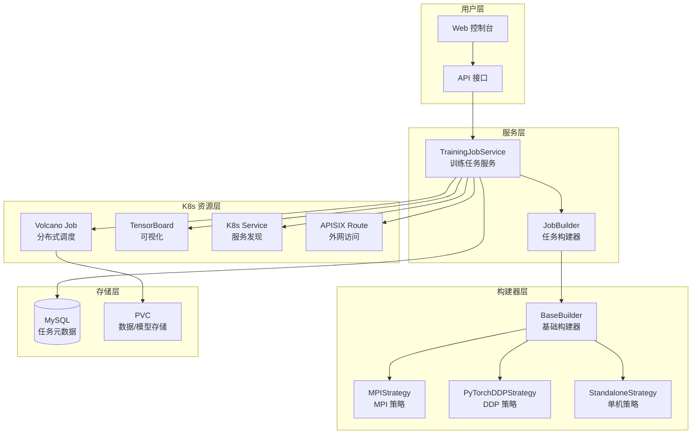
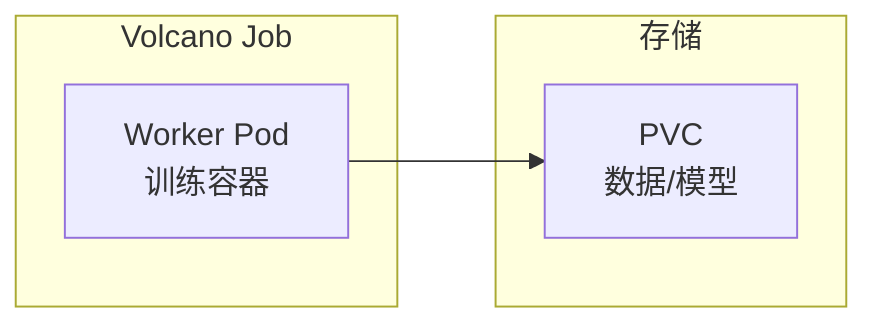
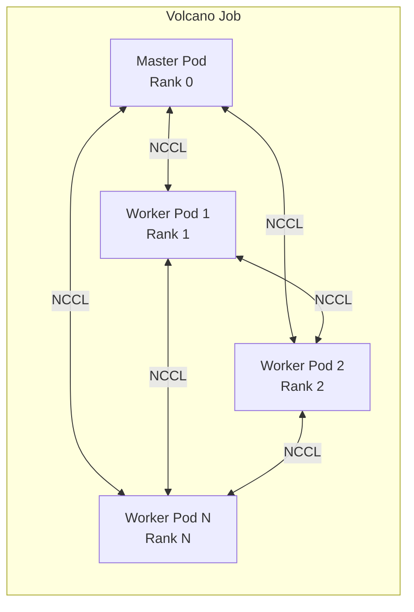
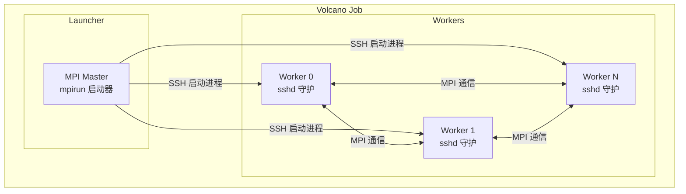
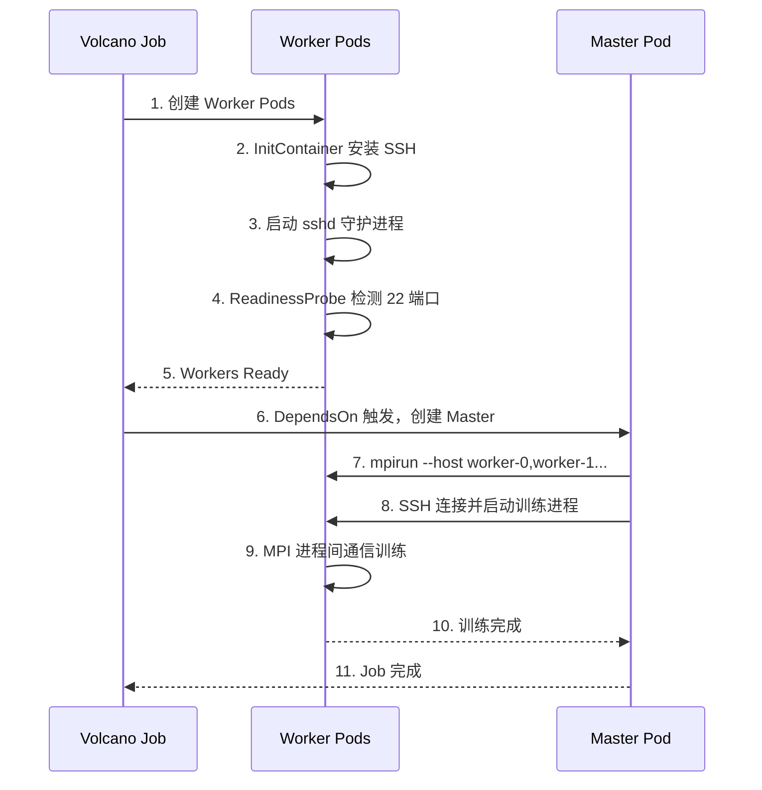
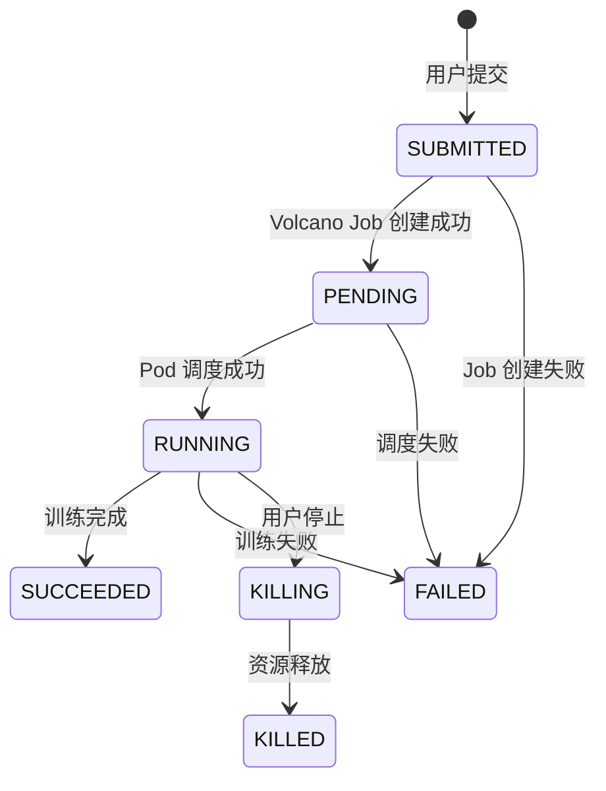
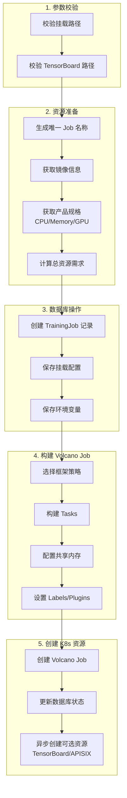
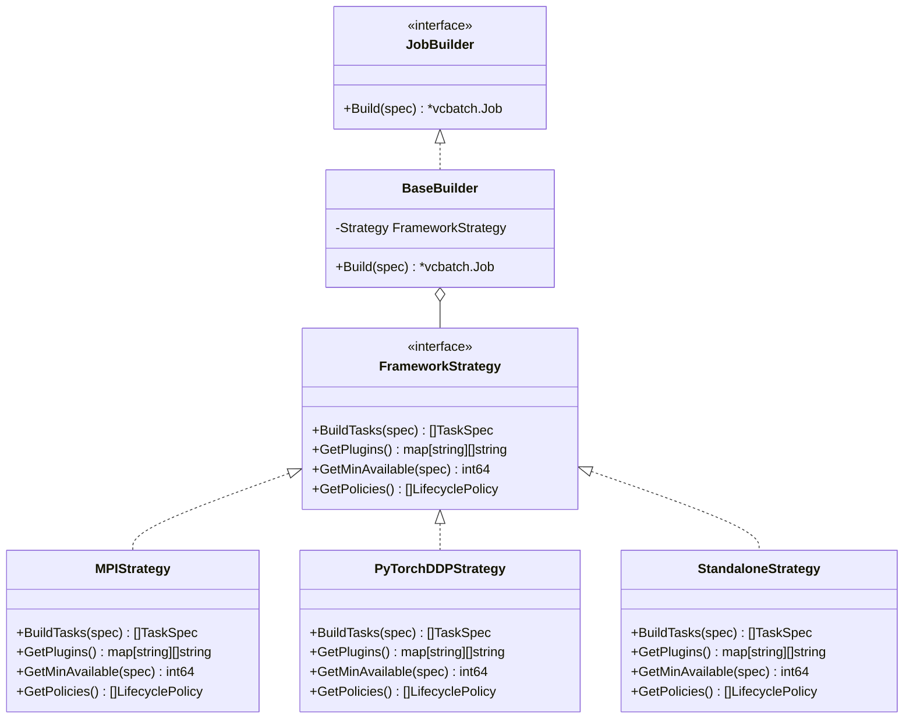
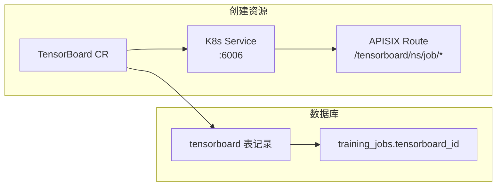
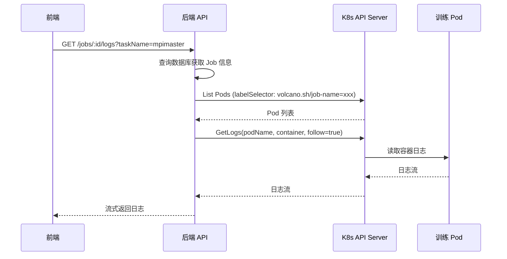

# 训练任务服务技术文档

## 概述

训练任务服务（Training Job Service）是 Neptune AI 平台的核心模块之一，负责管理深度学习模型的分布式训练任务。该模块基于 **Volcano Scheduler** 实现任务调度，支持多种分布式训练框架。

---

## 1. 架构设计

### 1.1 整体架构图



### 1.2 核心组件

| 组件 | 文件位置 | 职责 |
|------|----------|------|
| **TrainingJobService** | `training.go` | 训练任务的 CRUD 操作、生命周期管理 |
| **JobBuilder** | `builder/builder.go` | 构建 Volcano Job 的工厂模式入口 |
| **MPIStrategy** | `builder/mpi_builder.go` | MPI 分布式训练的 Pod 配置 |
| **PyTorchDDPStrategy** | `builder/pytorch_builder.go` | PyTorch DDP 分布式训练的 Pod 配置 |
| **StandaloneStrategy** | `builder/standalone_builder.go` | 单机训练的 Pod 配置 |
| **ResourceManager** | `resources.go` | TensorBoard、APISIX 路由等可选资源管理 |

---

## 2. 支持的训练框架

### 2.1 框架对比

| 框架类型 | 常量值 | 适用场景 | Pod 结构 | Volcano 插件 |
|---------|--------|---------|----------|-------------|
| **STANDALONE** | `STANDALONE` | 单卡/单机训练 | 1 Worker | `env` |
| **PyTorch DDP** | `PYTORCH_DDP` | PyTorch 分布式数据并行 | 1 Master + N Worker | `pytorch`, `svc`, `env` |
| **MPI** | `MPI` | Horovod/OpenMPI 分布式 | 1 Launcher + N Worker | `ssh`, `svc` |

### 2.2 框架详解

#### 2.2.1 STANDALONE（单机模式）



**特点**：
- 最简单的训练模式
- 只创建一个 Worker Pod
- Pod 失败时重启 Task（而非整个 Job）
- 适合单卡或单机多卡训练

**配置示例**：
```go
// GetMinAvailable 返回 1
func (s *StandaloneStrategy) GetMinAvailable(spec *TrainingJobSpec) int64 {
    return 1
}

// GetPolicies: Pod 失败重启 Task
func (s *StandaloneStrategy) GetPolicies() []vcbatch.LifecyclePolicy {
    return []vcbatch.LifecyclePolicy{
        {Event: vcbus.PodFailedEvent, Action: vcbus.RestartTaskAction},
    }
}
```

#### 2.2.2 PyTorch DDP（分布式数据并行）



**特点**：
- Master 和 Worker 都参与计算（Master 是 Rank 0）
- 使用 Volcano `pytorch` 插件自动注入环境变量：`MASTER_ADDR`, `MASTER_PORT`, `WORLD_SIZE`, `RANK`
- 使用 `svc` 插件实现 Pod 间 DNS 发现
- 任意 Pod 失败则重启整个 Job

**环境变量**：
```bash
MASTER_ADDR=<job-name>-master-0.<job-name>
MASTER_PORT=29500
WORLD_SIZE=4        # 总进程数
RANK=0/1/2/3        # 当前进程排名
NCCL_DEBUG=INFO     # NCCL 调试日志
```

#### 2.2.3 MPI（消息传递接口）



**特点**：
- Master（Launcher）**不参与计算**，只负责通过 `mpirun` 启动 Worker 进程
- Worker 运行 `sshd` 守护进程，等待 Master SSH 连接
- 使用 Volcano `ssh` 插件自动配置免密 SSH
- 使用 `svc` 插件实现 Pod 间 DNS 发现
- Worker 使用 `DependsOn` 机制，Master 等待所有 Worker Ready 后才启动

**MPI 启动流程**：


**SSH 安装机制**：
```go
// InitContainer: 检查并安装 openssh-server
sshInitContainer := corev1.Container{
    Name:  "install-ssh",
    Image: spec.Image,  // 使用与主容器相同的镜像
    Command: []string{"/bin/bash", "-c", `
        if command -v sshd >/dev/null 2>&1; then
            echo "SSH already installed"
            exit 0
        fi
        # 自动检测包管理器并安装
        if command -v apt-get >/dev/null 2>&1; then
            apt-get update && apt-get install -y openssh-server
        elif command -v yum >/dev/null 2>&1; then
            yum install -y openssh-server
        fi
    `},
}
```

---

## 3. 数据模型

### 3.1 TrainingJob（训练任务）

```sql
CREATE TABLE training_jobs (
    id              BIGINT PRIMARY KEY AUTO_INCREMENT,
    display_name    VARCHAR(63) NOT NULL COMMENT '展示名称',
    user_id         BIGINT NOT NULL COMMENT '用户ID',
    namespace       VARCHAR(63) DEFAULT 'default' COMMENT '命名空间',
    cluster_id      BIGINT NOT NULL COMMENT '集群ID',
    framework_type  VARCHAR(50) NOT NULL COMMENT '框架类型',
    image_id        BIGINT NOT NULL COMMENT '镜像ID',
    startup_command TEXT COMMENT '启动命令',
    total_gpu_count INT DEFAULT 0 COMMENT 'GPU总数',
    gpu_type        VARCHAR(50) COMMENT 'GPU类型',
    resource_id     BIGINT COMMENT '资源配置ID',
    worker_count    INT COMMENT 'Worker数量',
    master_cpu      INT COMMENT 'Master CPU',
    master_memory   INT COMMENT 'Master内存(Gi)',
    worker_cpu      INT COMMENT 'Worker CPU',
    worker_memory   INT COMMENT 'Worker内存(Gi)',
    worker_gpu      INT COMMENT '每个Worker的GPU数量',
    use_shm         BOOLEAN DEFAULT TRUE COMMENT '是否使用共享内存',
    shm_size        INT COMMENT '共享内存大小(Gi)',
    k8s_job_uid     VARCHAR(128) COMMENT 'K8s Job UID',
    job_name        VARCHAR(128) COMMENT 'K8s Job名称',
    status          VARCHAR(50) DEFAULT 'SUBMITTED' COMMENT '状态',
    error_msg       TEXT COMMENT '错误信息',
    started_at      DATETIME COMMENT '开始时间',
    finished_at     DATETIME COMMENT '结束时间',
    -- TensorBoard
    enable_tensorboard   BOOLEAN DEFAULT FALSE,
    tensorboard_log_path VARCHAR(512),
    tensorboard_id       BIGINT,
    -- 计费
    pay_type        INT DEFAULT 1 COMMENT '付费类型',
    price           DECIMAL(10,4) COMMENT '单价',
    created_at      DATETIME,
    updated_at      DATETIME,
    deleted_at      DATETIME
);
```

### 3.2 状态机



| 状态 | 常量 | 说明 |
|------|------|------|
| SUBMITTED | `JobStatusSubmitted` | 用户已提交，等待创建 K8s 资源 |
| PENDING | `JobStatusPending` | K8s Job 已创建，等待 Pod 调度 |
| RUNNING | `JobStatusRunning` | Pod 正在运行 |
| SUCCEEDED | `JobStatusSucceeded` | 训练成功完成 |
| FAILED | `JobStatusFailed` | 训练失败 |
| KILLING | `JobStatusKilling` | 正在终止 |
| KILLED | `JobStatusKilled` | 已终止 |

---

## 4. 核心流程

### 4.1 创建训练任务



### 4.2 代码流程

```go
// 1. CreateTrainingJob 主入口
func (s *TrainingJobService) CreateTrainingJob(ctx context.Context, req *CreateTrainingJobReq) {
    // 1.1 参数校验
    s.validateCreateRequest(req)
    
    // 1.2 生成唯一名称
    jobName := helper.GenerateInstanceName("training")
    
    // 1.3 获取镜像和产品规格
    image := getImage(req.ImageId)
    product := getProduct(req.ResourceId)
    
    // 1.4 创建数据库记录
    job := &TrainingJob{...}
    db.Create(job)
    
    // 1.5 构建 Volcano Job
    jobSpec := s.buildJobSpec(job, image, req)
    builder := builder.NewJobBuilder(req.FrameworkType)
    volcanoJob := builder.Build(jobSpec)
    
    // 1.6 创建 K8s 资源
    cluster.VolcanoClient.Jobs(namespace).Create(volcanoJob)
    
    // 1.7 异步创建可选资源
    go s.createOptionalResources(ctx, job, req, cluster)
}
```

---

## 5. 构建器模式

### 5.1 策略模式设计



### 5.2 工厂方法

```go
// NewJobBuilder 根据框架类型创建对应的 Builder
func NewJobBuilder(framework string) JobBuilder {
    var strategy FrameworkStrategy
    switch framework {
    case "PYTORCH_DDP":
        strategy = &PyTorchDDPStrategy{}
    case "MPI":
        strategy = &MPIStrategy{}
    case "STANDALONE":
        strategy = &StandaloneStrategy{}
    default:
        strategy = &StandaloneStrategy{}
    }
    return &BaseBuilder{Strategy: strategy}
}
```

---

## 6. 可选资源管理

### 6.1 TensorBoard 集成

创建训练任务时，如果 `EnableTensorboard=true`，会异步创建以下资源：



**访问路径**：`http://{baseDomain}/tensorboard/{namespace}/{jobName}/`

### 6.2 资源清理

删除训练任务时，会同时清理关联的可选资源：

```go
func (s *TrainingJobService) deleteOptionalResources(ctx context.Context, job *TrainingJob, cluster) {
    if job.EnableTensorboard {
        // 删除 K8s Service
        cluster.ClientSet.CoreV1().Services(job.Namespace).Delete(ctx, tbName, ...)
        
        // 删除 TensorBoard CR
        tbManager.DeleteTensorboard(ctx, ...)
        
        // 删除 APISIX Route
        apisixMgr.DeleteRoute(ctx, ...)
        
        // 软删除数据库记录
        db.Where("owner_type = ? AND owner_id = ?", "training", job.ID).Delete(&Tensorboard{})
    }
}
```

---

## 7. 共享内存（SHM）

深度学习框架通常需要大量共享内存用于进程间通信（如 PyTorch DataLoader 多进程加载）。

### 7.1 配置方式

```go
// 自动计算 SHM 大小 = Worker 内存 × Worker 数量
shmSize := product.Memory * req.WorkerCount
useSHM := true

// 创建 EmptyDir Volume（Medium=Memory）
func buildSHMVolume(shmSize int64) (Volume, VolumeMount) {
    sizeLimit := resource.MustParse(fmt.Sprintf("%dGi", shmSize))
    
    volume := corev1.Volume{
        Name: "shm",
        VolumeSource: corev1.VolumeSource{
            EmptyDir: &corev1.EmptyDirVolumeSource{
                Medium:    corev1.StorageMediumMemory,
                SizeLimit: &sizeLimit,
            },
        },
    }
    
    mount := corev1.VolumeMount{
        Name:      "shm",
        MountPath: "/dev/shm",
    }
    
    return volume, mount
}
```

### 7.2 挂载到所有容器

```go
// 为每个 Task 的容器添加 SHM 挂载
for i := range tasks {
    for j := range tasks[i].Template.Spec.Containers {
        tasks[i].Template.Spec.Containers[j].VolumeMounts = append(
            tasks[i].Template.Spec.Containers[j].VolumeMounts,
            shmMount,
        )
    }
    tasks[i].Template.Spec.Volumes = append(tasks[i].Template.Spec.Volumes, shmVolume)
}
```

---

## 8. 回滚机制

创建训练任务过程中如果发生错误，会自动回滚已创建的资源：

```go
// 资源清理器
cleanups := make(Cleanups, 0)
defer func() {
    if err != nil {
        cleanupCtx := context.Background()  // 使用独立 context，避免被取消
        for i := len(cleanups) - 1; i >= 0; i-- {  // 逆序回滚
            cleanups[i](cleanupCtx)
        }
    }
}()

// 创建 Volcano Job 后添加清理函数
cleanups = append(cleanups, func(cleanupCtx context.Context) {
    cluster.VolcanoClient.Jobs(namespace).Delete(cleanupCtx, jobName, ...)
})
```

---

## 9. API 接口

| 方法 | 路径 | 说明 |
|------|------|------|
| POST | `/api/v1/training/jobs` | 创建训练任务 |
| GET | `/api/v1/training/jobs` | 获取训练任务列表 |
| GET | `/api/v1/training/jobs/:id` | 获取训练任务详情 |
| DELETE | `/api/v1/training/jobs/:id` | 删除训练任务 |
| POST | `/api/v1/training/jobs/:id/stop` | 停止训练任务 |
| GET | `/api/v1/training/jobs/:id/logs` | 获取训练日志 |
| GET | `/api/v1/training/jobs/:id/pods` | 获取 Pod 列表 |

---

## 10. 日志获取

### 10.1 日志流程



### 10.2 TaskName 自动推断

```go
// 确定 TaskName
taskName := req.TaskName
if taskName == "" {
    if job.FrameworkType == "MPI" {
        taskName = "mpimaster"  // MPI 模式查看 Launcher 日志
    } else {
        taskName = "master"     // DDP 模式查看 Master 日志
    }
}
```

---

## 11. 扩展指南

### 11.1 添加新的训练框架

1. 创建新的策略文件 `builder/xxx_builder.go`
2. 实现 `FrameworkStrategy` 接口
3. 在 `NewJobBuilder` 工厂方法中注册
4. 添加框架类型常量

```go
// 1. 实现策略接口
type NewFrameworkStrategy struct{}

func (s *NewFrameworkStrategy) BuildTasks(spec *TrainingJobSpec) ([]vcbatch.TaskSpec, error) {
    // 构建 Task 配置
}

func (s *NewFrameworkStrategy) GetPlugins() map[string][]string {
    // 返回 Volcano 插件配置
}

func (s *NewFrameworkStrategy) GetMinAvailable(spec *TrainingJobSpec) int64 {
    // 返回最小可用 Pod 数
}

func (s *NewFrameworkStrategy) GetPolicies() []vcbatch.LifecyclePolicy {
    // 返回生命周期策略
}

// 2. 注册到工厂方法
func NewJobBuilder(framework string) JobBuilder {
    switch framework {
    case "NEW_FRAMEWORK":
        strategy = &NewFrameworkStrategy{}
    // ...
    }
}

// 3. 添加常量
const FrameworkNewFramework = "NEW_FRAMEWORK"
```

### 11.2 添加新的可选资源

在 `resources.go` 中添加新的资源创建/删除逻辑：

```go
func (s *TrainingJobService) createOptionalResources(...) {
    if req.EnableTensorboard {
        s.createTensorboard(ctx, job, req, cluster)
    }
    
    // 添加新资源
    if req.EnableNewFeature {
        s.createNewFeature(ctx, job, req, cluster)
    }
}

func (s *TrainingJobService) deleteOptionalResources(...) {
    if job.EnableTensorboard {
        s.deleteTensorboardResources(ctx, job, cluster)
    }
    
    // 删除新资源
    if job.EnableNewFeature {
        s.deleteNewFeatureResources(ctx, job, cluster)
    }
}
```

---

## 12. 常见问题

| 问题 | 原因 | 解决方案 |
|------|------|---------|
| MPI Worker Pod 无法启动 SSH | 镜像没有预装 openssh-server | InitContainer 会自动检测并安装 |
| MPI Master 一直等待 | Worker Pod 未 Ready | 检查 Worker 的 ReadinessProbe (TCP:22) |
| DDP 训练无法通信 | NCCL 网络配置问题 | 检查 NCCL_DEBUG 日志，确认网络接口 |
| 共享内存不足 | /dev/shm 大小不够 | 调整 SHMSize 参数 |
| TensorBoard 无法访问 | APISIX 路由未创建 | 检查 `createTensorboardRoute` 日志 |
